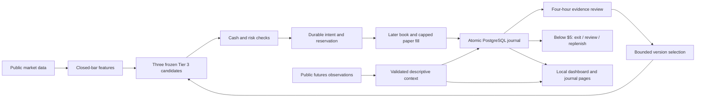

# Architecture

FastAPI owns the monitor and paper workers. The monitor's SQLite capture remains
separate from financial work. Five public GET endpoints and a fixed public WebSocket
origin are allowlisted; no authenticated exchange route, signing, or model API exists.
Sequenced diff depth is reconstructed from a REST bootstrap; gaps invalidate the book
until resynchronization. Clock offset/uncertainty and local monotonic receipt age both
gate freshness. Explicit REST fallback retains local receipt/RTT, never a fabricated
exchange event timestamp. HTTP 429/418 impose shared cooldown and weighted pacing.

| Component | Responsibility |
|---|---|
| `paper_strategy.py` | Contiguous closed candles, 5-minute EMA20, Wilder ATR14, frozen variants |
| `paper_engine.py` | Decimal reservations, delayed fills, fees, exits, risk, attempts, reviews |
| `paper_store.py` | PostgreSQL writer ownership, atomic state/journal, reconciliation, audit pages |
| `paper_runtime.py` | Shared warmup, snapshot/reporting and original observation model |
| `tiered_runtime.py` | Discovery, independent feed/reference/archive/context workers, fallback, timing, durable summaries |
| `futures_context.py` | Read-only Kraken contract mapping, bounded snapshots, funding/OI/basis and freshness |
| `options_data.py` / `options_policy.py` | Anonymous historical AAPL allowlist, source receipts and frozen daily policies |
| `options_engine.py` / `options_store.py` | Separate cash/options inventory, settlement, expiry gaps and append-only schema |
| `options_runtime.py` / `OptionsPanel.tsx` | Bounded chronological replay, four-hour review and labeled historical dashboard |
| `stream_feed.py` / `stream_book.py` | Public push channels, exchange clock, sequence/coverage/freshness validation |
| `universe.py` | Bounded USD liquidity screen, promotion/demotion, held-position priority |
| `stream_capture.py` | Separate bounded raw SQLite capture, pruning counters, disk usage |
| `api.py` | Loopback reads and same-origin operator controls |
| `PaperPanel.tsx` | Primary account, shadows, positions, reviews, decisions, and funding |
| `FeedPanel.tsx` | Actual transport, observation age, tiers, CPU, storage and retention limits |
| `FuturesPanel.tsx` | Observed futures context with age, units and explicit coverage gaps |
| `Run-PaperExperiment.ps1` | Hidden supervised process, health checks, owned-worker restart |
| `Install-PaperStartup.ps1` | Current-user sign-in task |

Money uses decimal strings at JSON boundaries. Each journal event balances by asset.
A database transaction locks state, appends events and journal lines, and advances
the projection together. An IOC requires a subsequent fresh book. Repeated evidence
cannot reconsume already-used liquidity in an account. Reporting lacks writer authority.

Reviews require ten fully contained trades per candidate and incumbent in each of
two disjoint four-hour windows, after at least eight hours without promotion.
A challenger must have positive stressed P&L, better mean trade return, and no worse
lifetime drawdown (also <=35%). Promotion requires a flat primary account. These
are transparent experimental gates, not proof of a durable statistical edge.
Holdings retain their entry version. Financial history is never trimmed like monitor data.

Two additional paired accounts compare the same breakout variant on BTC/ETH versus
the screened universe. Funding and inventory are isolated; reconciliation checks every
inventory asset, including additional coins. Universe results enter reviews but cannot
automatically change the primary universe. The feed model transition is journaled and
old entry intents are cancelled; fee/risk limits and minimum one-second fill delay stay fixed.

Raw records use a separate SQLite writer with a 20,000-record / 64 MiB payload ceiling;
older raw data expires with visible counts. Full tick replay is therefore bounded.
Permanent PostgreSQL minute bars, sampled-book summaries, scans, financial events and
reviews continue growing. CPU and storage measurements are advisory; workload under a
connected eight-symbol push feed and long-term backup capacity remain unverified.

The optional future model path is read-only evidence -> explanation or proposal ->
deterministic testing. Model output cannot write financial state or authorize trades.

The separate futures client permits only public instrument metadata and selected
linear USD perpetual tickers, with no authentication or execution methods. At most
eight markets use two concurrent GETs roughly once a minute; metadata refreshes hourly.
Complete selected ticker responses and request/exchange timestamps enter permanent
events. Contract identity fields and hashes accompany context; full metadata remains
in the bounded raw ring. Old/missing data is unknown, never neutral or zero. Worker
failures leave spot processing running. Startup requires fresh context before use.

Context is attached to order/fill evidence, aggregated descriptively for each four-hour
review, and included with timestamp caveats in failure reviews. It is not an input to
strategy features or version selection. One venue's funding/open interest is not a
market-wide measure or proof of directional pressure.

Options run in an independent worker and PostgreSQL schema with separate writer ownership.
Only AAPL historical calendar, chain and contract-quote routes are allowed, without a token.
The calendar supplies session dates only; features use as-of underlying prices from chains.
One session advances each minute, within 60 persisted requests/day and at most five/minute.
The initial calendar contains the latest 90 completed sessions; refresh is every 12 hours.
Missing evidence is recorded; historical dates never rewind or rerun as new outcomes.

An options intent at session D can fill only on a later session's valid quote, with premium
and both fee sides reserved. Entries use ask, exits use bid, and each account takes at most
one purchased standard contract and 10% displayed size. Sales remain unsettled until the
next observed session. Missing expiry disposition freezes valuation and entries instead of
inventing cash settlement or unaffordable stock exercise. Reviews compare two disjoint
20-session historical windows, not the spot account's four-hour market windows. Prior
results and parameters remain immutable. See the [options contract](research/2026-09-27-free-options.md).
