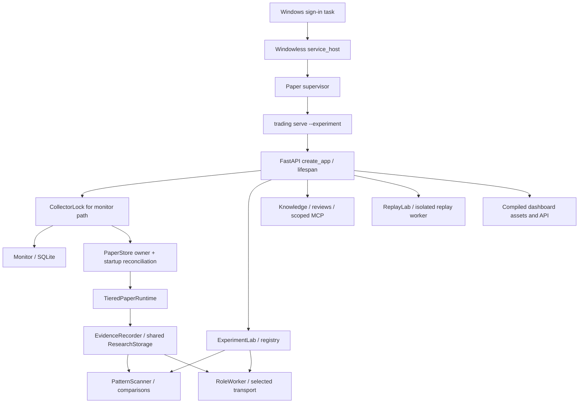

# Architecture and owner handoffs

## From startup to background work

[CLI entry](source-index.md#platform-cli) parses `serve`, `paper-report` and
offline `replay`. `serve --experiment` passes the existing paper database
configuration to [create_app](source-index.md#platform-app), serves the compiled
dashboard and binds Uvicorn to loopback with one worker. Without `--experiment`,
the public monitor is available without creating the paper runtime.

Arrows are inspected construction/data dependencies. They do not mean every
optional branch is enabled, healthy or running. The exact
[lifespan](source-index.md#platform-lifespan) acquires collector ownership,
creates the monitor/tool journal, and conditionally creates the paper owner.
Paper startup initializes retained state and refuses an unbalanced journal.
`api.py` binds the local name `PaperRuntime` to `TieredPaperRuntime`. The older
`paper_runtime.py` implementation is a separate source path. Live feed/reference/archive/context workers are
described in [market data](market-data.md).

Optional tool-journal, Lab, scanner, knowledge/reviewer or replay storage failures
are recorded on their respective status owners. Several permit paper management
to continue; a failed optional constructor is not a successful empty result.
The role transport is selected from existing local configuration. The roles'
activation callable reads its `enabled` policy; creating a RoleWorker task does
not grant inference or financial authority.

## Data and authority boundaries

| Owner | Durable inputs/output | Boundary |
| --- | --- | --- |
| [MonitorStore](source-index.md#platform-monitor-store) / Monitor | Separate public-monitor SQLite captures/status | Bounded monitor retention; no financial journal authority |
| PaperStore / OptionsStore | PostgreSQL state, events, journals and separate options schema | Deterministic cash/accounting, writer identity, reconciliation |
| TieredPaperRuntime / EvidenceRecorder | Feed observations, recording and shared research storage | Market freshness, coverage, financial/recording priority |
| ExperimentLab / ExperimentRegistry | Experimental specs, packets, results, inbox and history | Idempotent research state; does not bypass financial admission |
| RoleWorker / transport | Original questions, attempts, answers, tool/result archive | Explicit role capability, retained failures, resource/health checks |
| ResearchKnowledge / ResearchReviews | Library sources, review jobs and results | Owned storage, rights/provenance and separately authorized provider |
| ReplayLab | Recorded evidence and execution replay receipts | Replay/synthetic evidence remains labeled |
| Training bridge | Export/preparation/link records for separate Lab | Q-Trades evidence ownership; separate training/qualification authority |
| Dashboard / API | Projections and typed operator commands | Read projections grant no financial writer/model authority |

The authoritative implementation is the code and current policy. The older
[architecture overview](../ARCHITECTURE.md), [foundation](../FOUNDATION.md),
[status history](../STATUS.md) and dated research notes remain useful context;
their historical counts, limits and “enabled” statements are not current operating
observations. Never copy their older storage limits over a current frozen plan.

## Shutdown and recovery

`lifespan` cancels and awaits review/manual-review, role, replay, Lab, options,
paper and monitor tasks before closing their corresponding stores/clients and
releasing CollectorLock. Inspect each owner's cancellation/drain path when
changing shutdown order. The recorder's shared storage passed to the tool journal,
scanner and RoleWorker must not be silently replaced by another constructor.

[CollectorLock](source-index.md#platform-collector-lock) protects the monitor file;
the financial owner uses a different database ownership mechanism. A free API port
does not prove a database writer identity, and a lock file alone does not prove a
currently live process. See [runtime identities](runtime-updates.md#process-and-task-identity).

## Building or troubleshooting a change

1. Identify the checked-out commit and the installed target separately.
2. Use the relevant workflow guide to locate the assigning owner, consumer and persistence boundary.
3. Read the failure/retry/cancellation behavior and the relevant test conditions.
4. Keep Decimal money, original evidence, versioned policies and account isolation intact.
5. Verify the changed workflow; report focused checks, full hosted gates and operating acceptance separately.

The [package/build configuration](source-index.md#platform-package) defines the
`trading` CLI, Python version, application dependencies and test source path.
[Settings](source-index.md#platform-settings) validates the separate public-monitor
configuration; it is not the entire paper/research/storage policy. The
[compose definition](source-index.md#platform-compose) owns the dedicated database
container declaration; changing it is an operating database decision, not map upkeep.
