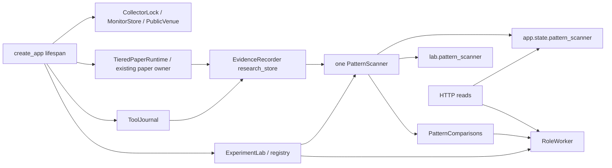
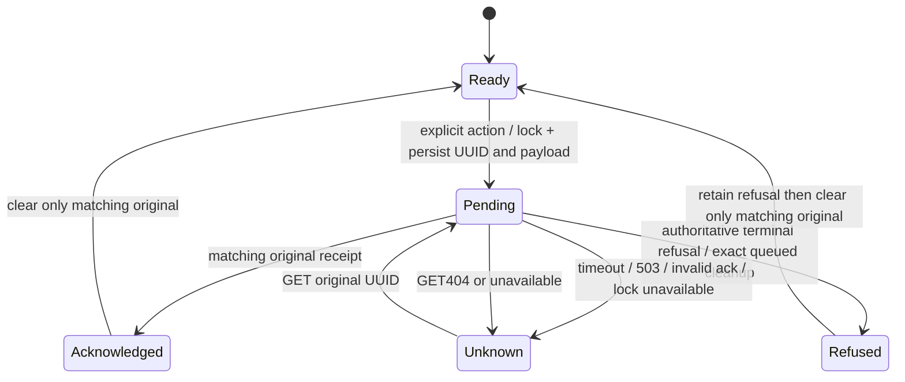

# Dashboard, API and command recovery

This guide maps the current checked-out dashboard/API contracts. It does not claim that this branch is merged, installed or operating. A source build, hosted gate, synthetic browser fixture and installed read-only observation are separate proof stages. Use the generated [source index](source-index.md) to find declarations, and the owning lane's retained receipts for observed execution. The [market guide](market-data.md) explains feed freshness; the [scanner guide](scanner-charts.md) explains saved chart scope.

## Normal navigation and selected scope

The normal destinations are Overview, Research, Accounts & Results, Markets and
Settings. Overview replaces the old home composition, while Research exposes
the existing worker's investigations. Numerical tools, knowledge and Training
Lab are contextual details. `inContext` preserves explicit account, market,
task and trial between destinations. Explicit account selection preserves the
current view, clears an unrelated trial, and restores account scope on Back.
Performance, trade, positions and journal consumers do not silently use primary
when an explicit account is missing. Exact retained accounts and trials have
separate reads, including when the broad paper snapshot is unavailable.

## Coherent product setup and observation

[Bounded Overview](source-index.md#product-overview-read) composes metadata from
existing role, scanner, comparison and notice owners. Each observation carries
its own unavailable state. It does not select questions, disclose full task
evidence, dispatch a model or write financial state. Its normal React consumer
uses non-overlapping seven-second reads, then eight-second visible or
thirty-second hidden refresh. Main's existing paper-status polling remains.

[Setup](source-index.md#product-setup-panel) reviews saved allocations, costs,
scope, pauses and current control revisions. A new recurring model scope first
requires an existing retained trained profile, metadata review and explicit
approval, then is saved disabled. The current owner is loaded by an explicitly
authorized application restart; opening setup does not restart or activate it.
[Supervised startup](source-index.md#product-supervised-start) rechecks exact
scope/policy and control revisions under existing owners. A newer Pause clears
the UI review and fences the old command; finite/manual grants cannot be widened.
Browser pending commands and locks coordinate settings without mount replay.
Component receipts distinguish refusal, saved intent and unknown acknowledgment.
Retained reads reconcile a saved component without committing it again.

The [product tests](source-index.md#product-owner-tests) prove read purity and
scope/control refusals. The [compiled browser driver](source-index.md#product-browser-proof)
uses real disposable PostgreSQL and worker/scanner owners with synthetic inputs,
resource observations, time and model responses. Polling remains enabled and
GETs never tick its background driver. This is software workflow evidence,
not actual model, prospective economic or installed acceptance.

[main.currentPage](source-index.md#dashboard-main-route) derives the page from the hash before query parameters. Unknown pages fall back to Overview. It preserves aliases such as `role-research`, `knowledge`, `forward-learning`, `experiment-lab` and `live-readiness`; teaching/result/comparison bookmarks resolve into the AI Lab training surface. [App](source-index.md#dashboard-app) selects the corresponding Lab/Risk tab on hash changes, closes navigation/search and scrolls to the page. Markets and Strategies lazily load [MarketStation](source-index.md#dashboard-market-station); Strategies sets `strategyOnly` and does not mount the main scanner/candle workspaces.

Market scope consists of **symbol and account**, not symbol alone. URL scope wins over local saved preferences. An invalid explicit symbol/account remains unavailable rather than silently selecting BTC or primary. [MarketStation.chooseScope](source-index.md#dashboard-market-scope) changes the URL/local preference and cancels obsolete evidence reads. It preserves `scanner_campaign`, preserves chart keys only for the same symbol, and can carry an explicit original `candle_run`. Account-only navigation must not destroy an exact same-market historical chart. A saved candle run can deliberately reopen its original market while preserving the user's selected account.

| Bookmark | Owner and behavior |
| --- | --- |
| `#markets?symbol=…&account=…` | MarketStation current scope; scope checks prevent a late other-market/account response from rendering |
| `scanner_campaign` | ScannerWorkspace exact saved campaign restore; current campaign is separate; missing/invalid original does not substitute current |
| `scanner_chart_frame`, `at_ms`/`before_ms`, `kind`/`seq`, progress/cursor keys under the `scanner_chart_` prefix | ScannerChartGrid exact historical window/record; progress pin refuses silent advancement |
| `daily_shortlist` | DailyAnalyzer immutable day; explicit history is not automatically replaced by latest |
| `pattern_comparison_request` | PatternComparisonPanel original UUID; verified receipt and mode/method intent |
| `candle_run` | CandleWorkspace original bounded tool receipt; no new candle acquisition |

The table abbreviates chart suffixes: actual URL names include the prefix, for example `scanner_chart_at_ms` and `scanner_chart_progress_sha256`. [ScannerWorkspace](source-index.md#scanner-workspace) coordinates daily/card/preparation callbacks and explicit current-versus-captured chart reads. Preserve these owner boundaries when adding links; do not create a second campaign authority key.

## Polling and asynchronous read ownership

[App](source-index.md#dashboard-app) requests `/api/status` with a seven-second bound, retains the last observation on failure, and schedules the next read after completion: three seconds visible, ten hidden. A network error makes current status unavailable; historical content is not a fresh health claim.

[MarketStation.usePoll](source-index.md#dashboard-station-poll) uses non-overlapping recursive scheduling, a three-second read bound, hidden-tab suppression and visibility admission. Live quote/tape refresh is normally one second; detail/tool history/accounts are slower. A 250 ms display clock ages quote validity between reads. Intervals measure browser refresh behavior, not producer latency or external feed speed.

[useEvidenceRead](source-index.md#dashboard-evidence-read) owns an AbortController and generation. Every new exact read cancels its predecessor. Only the current generation may publish response, error or loading state. Canceling a browser read does not undo a saved command or server-side disclosure. Selected task/UUID/scope refs add identity guards where digest verification or other awaited work can finish after a newer selection.

[ScannerChartGrid](source-index.md#scanner-chart-grid) has its own max-two read queue and per-frame serials. It retains successful response query separately from attempted query; failed-window paging cannot mix old overlay cursors with a new window. [PatternComparisonPanel](source-index.md#scanner-comparison-panel) rechecks original-read identity after digest validation and cancels a competing description after valid original adoption. These guards protect actual later promises, not just fetch cancellation.

## API startup and owner identity

[create_app.lifespan](source-index.md#dashboard-api-lifespan) acquires collector ownership, constructs Monitor/ToolJournal, optionally initializes/reconciles the paper store, creates the paper runtime and existing Lab, and wires scanner/worker/comparison owners. `app.state.pattern_scanner` and `lab.pattern_scanner` are the same scanner. Tool/scanner/archive work borrows the paper recorder when configured. Background owners are started by lifecycle configuration, not dashboard mount. Shutdown cancels/drains owned work before closing resources/releasing ownership.

[pattern_comparison_owner](source-index.md#dashboard-comparison-owner) requires any cached worker bridge to use the exact HTTP scanner and Lab registry. A foreign cached owner returns 503. It must not silently construct a new bridge or weaken this identity check. Disposable fixtures that replace scanner/registry/controller must replace the worker coherently and restore the original lifespan owners before shutdown. Declaring/importing a class is not evidence of this runtime wiring; the assignments and route calls above are the source edges.

## Local operator and actor boundaries

[TrustedHost configuration](source-index.md#dashboard-api-file) restricts hosts to localhost, 127.0.0.1 and the test host. [Security headers](source-index.md#dashboard-security-headers) add CSP restricted to self, no objects/frames, no-referrer, nosniff and API `Cache-Control: no-store`. These are local application protections, not a user login system or authorization for exposing the server publicly.

[lab_operator](source-index.md#dashboard-local-operator) requires `X-Local-Operator: 1`; when Origin is present it must be HTTP and exactly match Host. Missing Lab ownership is a 503, not an empty successful result. Collector and other operator routes apply their own explicit checks. [Scoped actor middleware](source-index.md#dashboard-scoped-actor) confines bearer actors to their task/claim/answer or MCP routes; actor credentials do not grant dashboard/operator/financial access.

Strict Pydantic command models reject extra keys and invalid types. The [training-body middleware](source-index.md#dashboard-training-body-limit) has a 256 KiB limit on its listed training/knowledge/review/MCP POST families; it is **not** a universal cap on every endpoint. Route-specific limits, enum/cursor validation and owner checks remain necessary. No source here grants permission for a model/provider call, acquisition, activation, financial change or installation merely because an endpoint exists.

## Route families and effects

| Route family | Source owner | Work/effect and important failures |
| --- | --- | --- |
| `/api/status`, `/api/health` | [status](source-index.md#dashboard-status-route), [health](source-index.md#dashboard-health-route) | Observed snapshots and installed marker/readback; unknown journal balance stays null. Health code identity is not checkout HEAD |
| `/api/paper/quotes`, `/api/station/live` | [station_live](source-index.md#dashboard-live-route), quote cache | No venue acquisition; current freshness/sequence may be unavailable |
| `/api/station/detail` | [station_detail](source-index.md#dashboard-detail-route) | Threaded exact account reader; invalid scope 422, missing owner 409, financial read failure 503 |
| `/api/research/tools/accounts` | [tool_accounts](source-index.md#dashboard-tool-accounts) | Current + bounded retired identity pages; no missing-account primary fallback |
| `/api/research/tools/run`, `/api/research/candle-patterns` | [run_tool](source-index.md#dashboard-tool-runner) | Explicit operator tool receipt; candle route performs bounded acquisition only when a new validated command is admitted |
| `/api/research/tools/runs/{id}`, `/candle-patterns/requests/{uuid}` | [tool_run](source-index.md#dashboard-tool-original), [candle_request](source-index.md#dashboard-candle-request) | Exact hot/cold saved receipt and native archive verification; missing 404 vs unavailable/corrupt 503 |
| `/api/research/pattern-scanner` and `/campaigns` | [scanner_status](source-index.md#dashboard-scanner-status), [scanner_campaigns](source-index.md#dashboard-scanner-campaigns) | Current or explicitly selected saved campaign; status includes bounded progress and omitted count |
| Scanner `/progress`, `/levels`, `/patterns`, `/alerts` | [scanner_page](source-index.md#dashboard-scanner-pages) | Progress pages cover the whole campaign; levels/patterns/alerts require exact campaign/symbol/frame. All use bounded original rows and pagination |
| Scanner `/control`, `/requests/{uuid}` | [scanner_control](source-index.md#dashboard-scanner-control), [scanner_request](source-index.md#dashboard-scanner-request) | Original UUID/revision control and GET reconciliation; current status is separate from original receipt |
| Scanner `/daily/shortlists`, `/{id}` | [daily pages](source-index.md#dashboard-daily-pages), [daily snapshot](source-index.md#dashboard-daily-snapshot) | Immutable day history; current roster is separate; absent exact original never becomes latest |
| Scanner `/chart` | [scanner_chart](source-index.md#dashboard-chart-route) | Saved projection only; invalid/progress-advanced 422, absent 404, unavailable retained source 503 |
| Scanner `/comparison-source`, `/comparisons`, `/{uuid}` | [source](source-index.md#dashboard-comparison-source), [prepare](source-index.md#dashboard-comparison-prepare), [history](source-index.md#dashboard-comparison-history), [original](source-index.md#dashboard-comparison-original) | Describe/list/original GET; explicit strict default-p0 preparation POST. No HTTP research-only/method override, submission or model effect |
| `/api/collector` | [collector](source-index.md#dashboard-collector-control) | Explicit monitor pause/resume; this is not scanner/research/account activation |

Synchronous comparison handlers run in FastAPI's normal threadpool. Async scanner/candle routes move registry/archive/CPU work to owned thread work and keep network acquisition asynchronous. Cancellation of owned work drains it before owner closure. [SQLite exception handling](source-index.md#dashboard-storage-failure) returns unavailable status instead of a valid-looking empty result.

GET does not universally mean state-pure. [Saved tool reopening](source-index.md#dashboard-tool-original) calls the evidence disclosure owner; [analogue retrieval](source-index.md#dashboard-analogue-disclosure) records conservative training consumption before returning captured past information. It does not dispatch a model or submit a strategy, but it can affect which intervals remain eligible for later research. Respect protected/holdout/prospective policies when adding a viewer. The cheap quote and saved scanner-chart paths remain separate read projections.

## Uncertain command recovery

[ScannerWorkspace](source-index.md#scanner-workspace) persists a validated command before its one POST under a Web Lock. Setup/start/enable cannot proceed while an original control is unresolved; an exact Pause can still intervene. Dispatch and acknowledgment use immediate lock availability. Only authoritative 400/403/409/422 terminal refusal cleanup queues behind the shared lock, then rechecks original UUID **and payload**, retains the refusal and removes only that command. A second window's newer command must survive. The delayed old Start 409 after acknowledged Pause is a normal supported boundary, not a reason to repeat Start or loosen revision checks.

503, timeout, invalid receipt or failed lock acknowledgment leaves the original command retained. “Find saved result” issues GET for that UUID; 404 means an earlier request may still apply. A valid receipt's action/campaign/revision must match the original; daily enable binds the immutable predecessor policy/campaign when a legitimate successor is created. The separate mutable `current_status` is not substituted for that original identity. POST may commit while the subsequent status read fails, so a failed response is not necessarily failed mutation.

The standalone candle controller and comparison preparation panel have their own durable pending owner and exact GET recovery. Comparison mode/method intent is canonical and digest-bound; a changed intent 409 must not discard the original. A saved read-only/p1 result cannot acknowledge or reinterpret an ordinary p0 pending request. The legacy generic tools have saved-run recovery but should not be described as sharing every newer durable-command guarantee.

## Old or wrong content after navigation

Check hash, selected symbol/account, original campaign/day/UUID, successful response scope and request generation. A saved record can legitimately display historical reasons while current inputs have changed; its labels/timestamps must preserve that distinction. An explicit “Inspect current campaign/charts” changes the route, whereas failed exact restore must not quietly do so. Compare source/build identity separately from the installed `/api/health` marker; reading newer TS source does not update already served compiled assets.

Use [station tests](source-index.md#dashboard-station-tests), [comparison API tests](source-index.md#dashboard-comparison-api-tests), [chart browser fixture](source-index.md#scanner-chart-browser) and [role evidence browser fixture](source-index.md#dashboard-role-evidence-browser). Existing source tests cover scope isolation, strict routes, cache freshness, lost acknowledgments and late-read ordering. This map has not executed these cases.

## Refused or stuck scanner controls

Preserve the exact pending UUID/payload, last original receipt/refusal and current status separately. Do not manually clear localStorage, resend a POST or invent a new UUID to turn unknown into success. Check Web Locks availability, another tab's saving/terminal cleanup, revision/campaign mismatch, operator Origin/header, owner readiness and persistence failure. Use [scanner API/control tests](source-index.md#scanner-year-tests) and [the deterministic two-tab control harness](source-index.md#scanner-control-browser). A static source read cannot prove every runtime interleaving; preserve actual failed artifacts and run only meaningful affected verification when behavior changes.

## Coverage and extension checklist

Map a new route to its actual owner, exact identity, side effects, resource/body/page limits, missing-versus-unavailable semantics and cancellation cleanup. Link it to a real normal UI action and tests for late response, lost acknowledgment, mismatched owner/scope and partial/missing inputs. Preserve original financial/account and model authority; local operator headers are not promotion permission. Do not call synthetic fixture account/history projections an installed financial workflow or infer current health from explanatory warning text. Broad browser/CI success and a focused rerun have different coverage; source map generation validates anchors, not whole-product correctness.
