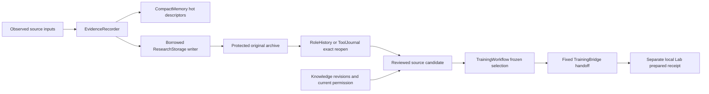

# Evidence, storage, memory, and training

Use this guide when a record cannot be reopened, cold rollover fails, knowledge permissions change, a memory experiment loses provenance, or a training preparation is interrupted. These layers preserve research evidence. They do not grant a model, promote a strategy, change an account rule, or establish a trading edge. Continue to [Research worker](research-worker.md) for task/attempt state and [Oversight tools](oversight-tools.md) for scoped disclosure.

## Evidence layers and owners

| Layer | Source owner | Durable identity and boundary |
| --- | --- | --- |
| Registry coordination | [ExperimentRegistry](source-index.md#research-registry) | Plans, events, tasks, proposals, leases and disclosure windows; no financial connection |
| Captured raw and compact inputs | [EvidenceRecorder](source-index.md#evidence-recorder), [EvidenceArchive](source-index.md#evidence-archive), [CompactMemory](source-index.md#evidence-compact-memory) | Original source cutoff, receipt/availability time, packet hash and archive reference remain distinct |
| Segmented research tiers | [ResearchStorage](source-index.md#evidence-storage) and [StoragePlan](source-index.md#evidence-storage-plan) | Explicit local volume identity, tier caps, scratch/free reserve, pins and append/reopen verification |
| Cold role and tool payloads | [RoleHistory](source-index.md#evidence-role-history), [ToolJournal](source-index.md#oversight-tool-journal) | Verified full original context/attempt/result under hot index references |
| Knowledge and permissions | [ResearchKnowledge](source-index.md#evidence-knowledge) | Immutable revisions, availability and current revocation checks; hashes do not prove truth |
| Mature lessons | [ResearchLessons](source-index.md#research-lessons) | Exact original outcome and authority, access/disclosure records and annotations |
| Reviewed examples and preparation | [TrainingWorkflow](source-index.md#evidence-training-workflow), [TrainingBridge](source-index.md#evidence-training-bridge) | Explicit review, dataset provenance and fixed private Lab handoff; no training launch authority |

The final node is a preparation receipt. It must report `trained=false` and `evaluated=false`; later training, evaluation, promotion and operating use have their own decisions.

## Shared writer and cold recovery

[EvidenceRecorder.research_store](source-index.md#evidence-borrow-store) borrows the existing live writer under its storage lock. Closed, not-ready, plan-mismatched or changed persisted identity refuses without starting a second recovery owner. [RoleHistory.storage](source-index.md#evidence-history-storage) uses the injected callback; explicit standalone use owns and closes its own ResearchStorage instance. Do not add a silent standalone fallback to a live application path.

[Storage admission](source-index.md#evidence-storage-admission) counts exact file use, tier caps and reserved scratch/free space. [File accounting](source-index.md#evidence-file-accounting) tolerates only known SQLite sidecar disappearance with bounded whole-tier recount; unrelated missing files, permission and I/O errors propagate. This protects against undercounting checkpoint growth. Configuration caps are selected storage envelopes; a source plan is not a fresh observation of installed disk capacity.

[Append](source-index.md#evidence-storage-append), [reopen](source-index.md#evidence-storage-reopen), protection pins and [housekeeping](source-index.md#evidence-storage-housekeeping) retain dependency identity. Pure [reopen_evidence](source-index.md#evidence-pure-reopen) verifies an existing packet/page without constructing a new mutable storage owner. Use it for a read projection that must not run recovery or DDL.

[Role rollover](source-index.md#evidence-history-rollover) has a source-defined hot limit of 512 tasks and bounded byte/headroom thresholds. Full archive payloads remain reopenable through verified references; a compact task must not be treated as the entire original evaluation. [Restore](source-index.md#evidence-history-restore) enables explicit failed-archive retry and preserves lineage, attempts, profiles, packets and allowances. Active waits are not forced cold merely to satisfy a fixture.

Keep lock lifetime visible: archive/file work can occur under the borrowed recorder owner, but publication of the compact task occurs after that borrow is released. Cancellation must drain owned work before close. Holding the registry lock while waiting for a recorder that will publish to the registry can invert the order.

## Startup summary and legacy adoption

[Initialization](source-index.md#evidence-storage-initialize) owns recovery and
startup summaries under the existing exclusive root lock. The
[count adoption](source-index.md#evidence-storage-count-adoption) certifies an
exact global record count with a version and actual index rowid watermark;
rowid is never interpreted as a count. Legacy or advanced indexes use durable
4,096-row keyset chunks. Partial scan cursor/count state has the observed target
watermark and remains separate from the uncertified public count. Only the final
empty seek publishes the complete count/version/mark and clears staging. A changed
target restarts the census. SQL and between-chunk guards refuse after five seconds
or five million VM instructions, preserving completed progress for retry. They
cannot preempt an operating-system I/O call.

Ordinary appends and recovery update count/watermark inside each index transaction.
Only newly indexed global SHA records count; physical segment duplicates do not.
The eight-segment recovery limit can refuse after completed transactions without
losing their counter changes. A lost index acknowledgment loses both its records
and counter update. The watermark contract assumes the production append-only
index; it does not certify arbitrary manual deletion or replacement of older rows.

[Latest capture](source-index.md#evidence-storage-latest-capture) seeks every actual
kind through the existing `(kind, at, segment, record)` covering index and takes
the latest timestamp in each kind. Unknown/empty kinds and out-of-order append
timestamps remain included. It does not scan every record, build another index,
trust a segment's last append time, or silently use a partial maximum.
The [startup tests](source-index.md#evidence-tests-storage-startup) check actual
query plans/VM work, legacy migration, durable crash/refusal/retry, original
availability and deduplication. [Capture recovery](source-index.md#evidence-tests-capture-recovery)
also exercises real rollback journals and the normal recorder's owned retry.

## Time, exposure, and knowledge permission

[Representation timing](source-index.md#evidence-timing) separates market cutoff from the time a recorded representation became available. A poll time, a later label, and an original decision time are not interchangeable. [Acquisition](source-index.md#evidence-acquisition) reopens bounded immutable/segmented archives with explicit unavailable outcomes rather than inventing inputs.

Knowledge import preserves source bytes/revision and disposition. [ResearchKnowledge current permission](source-index.md#evidence-knowledge-permission) requires both original and latest source metadata to remain eligible; a successor can revoke permission, but cannot retroactively grant an originally protected or local-only source. External delivery requires the explicit external-data disposition. Teaching additionally requires training permission in both original and current metadata.

[Native PDF extraction](source-index.md#evidence-knowledge-extract) is a finite local text child with a bounded document and at most six selected pages. Scanned or garbled pages refuse and need separately permitted OCR; this path does not invent text, fetch the network, or call a model.

[Knowledge read](source-index.md#evidence-knowledge-read) enforces the captured cutoff and current permission. Retrieval receipts retain exact delivered passages and source identities. [Knowledge acquisition](source-index.md#evidence-knowledge-acquire) is an operator-approved public-source path, not an arbitrary model or MCP network tool. Reindex, backup and restore belong to this owner and must retain revocations and historical revisions.

Information use also writes evidence-window disclosures. [Scoped tool disclosure](source-index.md#oversight-tool-disclosure), mature lesson access, pattern preparation and numerical evaluation record what the researcher actually saw. Protected prospective/holdout windows are not merely a UI filter. A research-only training-origin allowance is explicitly scoped to the reviewed branch; unknown, sealed or protected origins remain refused.

## Memory and research families

These modules share evidence but answer different questions. The all-source inventory links each family here; follow its owner before changing a similarly named field.

| Family | Starting reference | Interpretation |
| --- | --- | --- |
| Raw/compact evidence and features | [research_evidence](source-index.md#evidence-archive), [evidence_runtime](source-index.md#evidence-recorder) | Original capture and reproducible features; no account-fill authority |
| Episode descriptors and historical matches | [pattern_memory](source-index.md#evidence-pattern-memory) | Outcome-blind recognition descriptors; matching is not an executable signal |
| Frozen history estimator | [memory_quality](source-index.md#evidence-memory-quality) | Recognition and execution evidence remain separate; paired diagnostics do not qualify an edge |
| Condition and flow shadows | [context_flow](source-index.md#evidence-context-flow) | Local classification and sampled-flow comparison, not replacement financial rules |
| Append-only shadow updates | [incremental_memory](source-index.md#evidence-incremental-memory) | Predeclared staged learning journal; no in-place history rewrite |
| Snapshot/dataset adapters | [memory_dataset](source-index.md#evidence-memory-dataset) | Point-in-time executable labels and episode/split provenance |
| Complete account memory comparison | [memory_accounts](source-index.md#evidence-memory-accounts) | Declared A/B/C interval through the existing engine; refuses a missing prefix and does not reset accounts between observations |
| Original-window baseline audit | [recorded_window](source-index.md#evidence-recorded-window) | Same engine and original inputs; baseline verification, not a strategy-discovery comparison |
| Delayed labels | [outcome_continuation](source-index.md#evidence-outcome-continuation) | New immutable available-at label receipts; original capture archives remain independent |
| Persistent research plans and campaigns | [research_campaigns](source-index.md#evidence-campaigns), [research_experiment](source-index.md#evidence-experiment) | Bounded registered numerical work; observed quotes are not fills |
| Older advisory role protocol | [research_protocol](source-index.md#evidence-legacy-protocol), [research_inference](source-index.md#evidence-inference-profile) | Different versioned answer/prompt family; do not substitute lab-role grammar hashes |
| Current Lab role grammar/evidence | [lab_role_contract](source-index.md#research-role-contract), [role_evidence](source-index.md#research-role-evidence) | Strict idea/review/followup packets and compact retained-artifact references |
| Dataset semantic review and exports | [llm_training](source-index.md#evidence-training-data), [preflight](source-index.md#evidence-training-preflight), [offline evaluation](source-index.md#evidence-training-eval) | Rights, correctness, availability and episode-family review; hashes alone prove none of those judgments |

Other market, engine, scanner and UI families are indexed by [architecture](architecture.md) and their linked guides. Similar words such as “prediction,” “learning,” “review” and “training” must be read in their actual owner context.

## Training review and private Lab handoff

[TrainingWorkflow](source-index.md#evidence-training-workflow) selects explicit source candidates, saves semantic reviews, freezes rows and review revisions, preflights the same snapshot, then commits a unique handoff claim before external Lab work. A prior preparing/interrupted claim is reopened, not redispatched on a new browser UUID. A failed preparation uses an explicit retained retry after review.

[llm_training.prepare](source-index.md#evidence-training-prepare) combines adjudicated candidates, rights, point-in-time availability, original target and episode-family membership. Unreviewed exports are not accepted training examples. [Preflight](source-index.md#evidence-training-preflight) is a bounded diagnostic; the separate Lab is historical split authority. [Offline comparison](source-index.md#evidence-training-eval) measures contract diagnostics, not semantic correctness or economic qualification.

[TrainingBridge dispatch](source-index.md#evidence-training-dispatch) runs only the fixed local `llm_lab.cli application-handoff` command with `shell=False`, private-root and exact interpreter/Lab source identities, offline environment, bounded time/logs, and immutable job/nonce. For the `prepare` operation, it validates the original request/profile/dataset receipt and refuses a preparation result claiming trained or evaluated. [Reopen](source-index.md#evidence-training-reopen) uses the original archived profile and dataset manifest; current metadata is not a replacement for the original handoff. [Historical comparison readback](source-index.md#evidence-training-comparison) can retrieve an already evaluated Lab comparison through that same fixed route; it does not launch new training or evaluation.

[TrainingDataPanel](source-index.md#evidence-training-panel), [KnowledgeWorkspace](source-index.md#evidence-knowledge-panel), [EvidencePanel](source-index.md#evidence-panel) and [ResearchStoragePanel](source-index.md#evidence-storage-panel) are the normal consumer surfaces. A usable source result needs correct refusal/recovery in these consumers, not only a successful append or backend row.

## Investigation and change checks

| Symptom | Source seam and relevant checks |
| --- | --- |
| “Owner busy,” record closed, changed volume, cold payload absent | Borrow/identity/reopen before any alternate constructor; [storage tests](source-index.md#evidence-tests-storage), [file accounting tests](source-index.md#evidence-tests-accounting), [archive owner tests](source-index.md#research-tests-archive-owner) |
| Missing attempts, allowances or predecessor after rollover | Full original reference and restore; [history tests](source-index.md#evidence-tests-history), [supervision tests](source-index.md#research-tests-supervision) |
| Previously readable knowledge is unavailable | Current permission and original disposition; [knowledge recovery tests](source-index.md#evidence-tests-knowledge), [knowledge PostgreSQL tests](source-index.md#evidence-tests-knowledge-pg) |
| Training source/hash/review drift or interrupted preparation | Frozen selection, unique claim, archived profile, explicit retry; [training workflow tests](source-index.md#evidence-tests-training), [training contract tests](source-index.md#evidence-tests-training-data) |
| Memory/shadow score seems to imply strategy qualification | Original source cutoff, family/split separation and actual metrics; [memory quality tests](source-index.md#evidence-tests-memory-quality), [context tests](source-index.md#evidence-tests-context), [incremental tests](source-index.md#evidence-tests-incremental) |

Consult [verification](verification.md) for current commands and explicit disposable setup. This documentation work executes none of these operations. Test source, historical receipts, current source identity, a fresh native run, real model quality, dataset training, installed state and economic outcome are separate proof stages.
