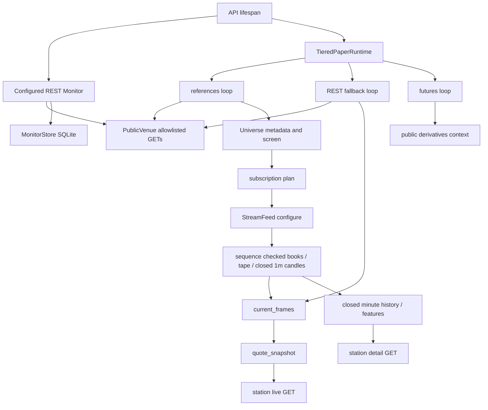

# Market data and observation owners

This guide maps the checked-out source. It does not attest that the candidate branch is installed, that a public feed is currently healthy, or that a strategy is profitable. Follow the generated [source index](source-index.md) for declarations and current source identity. The scanner's native historical pipeline is described in [Scanner, daily analysis and charts](scanner-charts.md); HTTP and browser ownership are described in [Dashboard and API](dashboard-api.md).

## The distinct data paths

| Path | Actual producer | Consumer and retained state | Meaning |
| --- | --- | --- | --- |
| Configured REST monitor | [Monitor.poll_once](source-index.md#market-rest-monitor) through a public venue | MonitorStore observations, latest book and events; dashboard status/capture | A configured public observation service; separate from the paper stream's executable frame selection |
| Current spot stream | [StreamFeed](source-index.md#market-stream-loop), planned by Universe and TieredPaperRuntime | In-memory books, trade tape, latest closed minute candle; stream capture and research recorder | Current sequence-checked observations, subject to clock and freshness checks |
| Current spot REST fallback | [TieredPaperRuntime._rest_book](source-index.md#market-rest-fallback) | Cached fallback receipt and current frame selector | A receipt-timed substitute for unavailable/expiring stream data; not an exchange event timestamp |
| Minute candle history | [PaperRuntime.collect_candles](source-index.md#market-minute-history) and [closed_stream_candle](source-index.md#market-closed-stream-candle) | Up to 600 closed minute bars, store bars, features, station detail | Current minute study inputs; bootstrap/backfill is not retroactive trading |
| Native historical candles | [PublicVenue.historical_candles](source-index.md#market-native-candle-venue) | Explicit candle study or year scanner; owned research archive | Native 5m/15m/30m/1h/4h intervals, not minute resampling |
| Kraken futures context | [FuturesContext.collect](source-index.md#market-futures-collect) | Descriptive cached context, original wire receipt and dashboard | Observation/research only; no futures execution or spot signal changes |

These are source call edges, not measurements from a running collector. [API lifespan](source-index.md#dashboard-api-lifespan) constructs the owners; [TieredPaperRuntime.run](source-index.md#market-runtime-run) starts its loops; [the references loop](source-index.md#market-reference-loop) actually calls metadata/tickers, updates the universe, consumes closed candles and changes subscriptions.

## Public spot venue and numerical validation

[PublicVenue._get](source-index.md#market-public-venue) allows only Binance.US exchange metadata, depth, klines, server time and 24-hour tickers. It uses public GETs, disables redirects and environment proxy inheritance, caps response bodies, and paces weighted requests. Metadata and ticker requests share that per-instance budget with depth and historical pages. HTTP 418/429 produce an explicit cooldown; network, malformed response and invalid market data remain failures. No signing, credentials or order endpoint belongs to this adapter.

[decimal_string](source-index.md#market-decimal-parser), [parse_book](source-index.md#market-book-parser) and [parse_instruments](source-index.md#market-instrument-parser) validate bounded finite Decimal strings, sequence identity, ordering, nonempty levels, uncrossed books and instrument filters. Preserve string prices through JSON and Decimal calculations. Floating-point chart coordinates are display projections, not authoritative financial arithmetic. A plausible-looking malformed payload must not become a zero price, an empty healthy book or an inferred instrument.

[request_counts](source-index.md#market-request-counts) is an in-memory epoch for one venue instance. Requested, sent, responses, completion, HTTP/rate/transport failures and cancellation before/after send are separate counters; keys are bounded with an overflow bucket. A requested call waiting for pacing is not a sent network request. A canceled sent call can have an unknown external completion. A restart starts a new epoch; this is not a reconstructed lifetime usage ledger.

## Universe eligibility and subscriptions

[Universe.metadata](source-index.md#market-universe-metadata) bounds discovery to 2,000 rows, requires USD spot trading metadata and excludes stable base assets. [Universe.screen](source-index.md#market-universe-screen) validates ticker identities, time and numerical fields. Eligibility requires fresh metadata/tickers, spread at most 25 bps, quote volume at least USD 100,000 and at least 300 trades. The source uses a 120-second ticker freshness window, tolerates at most five seconds of future close time, and expires metadata after 900 seconds.

Eligibility is separate from stream admission. Promotion requires two eligible screens; omission breaks the qualification streak. Held/pending markets remain protected against ordinary demotion. Existing eligible choices have a minimum retention interval. Ordinary extras are limited to four, with a six-extra capacity boundary; excessive held-market requirements refuse rather than silently omit required assets. The current ranking uses absolute price change and quote volume; it is not a prediction of future returns.

[Universe.plan](source-index.md#market-subscription-plan) keeps BTCUSD/ETHUSD and held markets on the 100 ms tier. Optional candidates can use the slower 1,000 ms tier; only two qualifying extras get the fast feature tier. Sustained runtime pressure demotes optional work through [TieredPaperRuntime.constrained](source-index.md#market-runtime-pressure). A market can be screened and eligible without being subscribed, warmed up or executable. Conversely, a held market can remain subscribed without being newly eligible. The daily scanner's captured roster and enrollment policy are a further separate owner.

## Stream sequence, clock and freshness

[StreamFeed.configure](source-index.md#market-stream-configure) validates at most eight bounded USD subscriptions and the supported 100/1,000 ms tiers. Changing the plan cancels and drains obsolete workers. Each [symbol loop](source-index.md#market-stream-loop) opens the fixed public depth/trade/minute-kline stream, obtains a REST depth snapshot, buffers a bounded set of updates and reconstructs the book through [DepthBook.apply](source-index.md#market-depth-apply). Sequence gaps, contradictory content, invalid depth or crossed books invalidate the stream book and require a new snapshot. Reconnect backoff and scheduled connection renewal are explicit; a reconnect does not make an old book fresh.

[ExchangeClock](source-index.md#market-exchange-clock) checks server-time round trip and wall/monotonic clock consistency. The sample expires; event age includes uncertainty and elapsed monotonic time. [fresh_books](source-index.md#market-fresh-books) allows at most 1,000 ms age on the fast tier and 2,500 ms on the slow tier. A wall-clock jump, invalid sample or old event prevents freshness even if the socket is connected.

[accept_aux](source-index.md#market-stream-aux) keeps a 40-entry trade tape, deduplicates IDs and records gaps rather than inventing intervening trades. It accepts only native 1m klines for the same symbol, and publishes a candle only after the venue declares it closed. Candle interval timestamps and message publication time are different fields. Trade tape coverage is not a durable account-outcome ledger.

## REST fallback and current quotes

[The fallback scheduler](source-index.md#market-fallback-scheduler) considers only the existing subscription plan, rate cooldown, per-market request spacing and one in-flight request per market. It can prefetch before a usable stream expires. [The REST request](source-index.md#market-rest-fallback) rejects a round trip over one second and regressing/repeated contradictory book sequences. Fast fallback spacing is 0.5 seconds; slow spacing is five seconds. Those spacing controls are not freshness extensions.

[current_frames](source-index.md#market-current-frames) selects validated stream/fallback observations, applies sequence and current instrument filters, and supplies the paper engine's actual frames. [quote_snapshot](source-index.md#market-live-quotes) is a cheaper read-only display projection of the same caches: at most eight planned markets, fresh or explicitly stale/unavailable, with source, receipt/event time, remaining freshness and reasons. It performs no venue request, journal write or execution mutation. It also checks runtime health and sequence consistency with the paper worker. A REST receipt must retain `exchange_event_ms: null`; it cannot inherit a WebSocket timestamp.

[market_live](source-index.md#market-station-live) combines this quote projection with bounded book/tape display. [market_detail](source-index.md#market-station-detail) returns minute candles, indicators, the selected account's recorded strategy evidence, a bounded screen and recent paper events. The browser subtracts time elapsed since its poll; it must not keep a fresh badge indefinitely between responses.

## Minute candles, capture and storage

[collect_candles](source-index.md#market-minute-history) bootstraps/backfills up to 600 closed 1m bars, throttles candle collection and merges by native opening time. A changed already-closed candle refuses study use. Missing intervals remain gaps. Bootstrap/backfill can support later research, but does not replay paper decisions or trades into the past. [closed_stream_candle](source-index.md#market-closed-stream-candle) adds actual closed stream observations and updates the same history/feature path.

[chart_indicators.overlays](source-index.md#market-minute-overlays) is the legacy minute chart's indicator path. It is distinct from the native chart analyzer's SMA10/50/100 and trailing-50 VWAP; do not compare their values as if they share an interval or VWAP anchor. [market_evidence](source-index.md#market-station-evidence) freezes the selected market's displayed values and their larger calculation basis rather than recomputing indicators from only the visible tail.

Persistence has several bounded owners, not one universal market database:

- [MonitorStore](source-index.md#market-monitor-store) keeps the configured collector's observations/events/latest key-value state and prunes within its own capacity/byte budget.
- [StreamCapture](source-index.md#market-stream-capture) stores raw stream batches in the stream SQLite file, with row/byte caps and accounted pruning. The feed's pending capture queue also reports dropped observations.
- [The capture loop](source-index.md#market-capture-loop) sends raw records to the stream capture and research recorder; financial commit/evidence linkage uses the existing paper owner, not a browser poll.
- [EvidenceRecorder.research_store](source-index.md#market-existing-storage-owner) lends the existing recorder writer under its RLock. Closed, unready or mismatched configured ownership refuses; scanner/candle retention does not create an alternate live recovery writer. Cancellation must drain owned archive work before teardown.

Native history retention, archive verification and the indexed scanner registry are mapped in the scanner guide. A raw capture being present is not proof of a complete causal execution window or mature financial outcome.

## Futures context

[FuturesPublicData.get](source-index.md#market-futures-public-client) permits only Kraken public instruments and bounded PF perpetual ticker routes. [resolve](source-index.md#market-futures-resolve) requires exactly one eligible USD flexible-futures contract, handles XBT/BTC aliases, and refuses absent/ambiguous/expired/tradfi identities. It does not infer a convenient contract from a similar symbol.

[accept](source-index.md#market-futures-accept) checks contract/pair/status and retains Decimal mark/index, premium, open interest and funding. Funding's recorded unit is **USD per base unit per hour**. The displayed hourly bps estimate uses the current index approximation; it is not the original funding quote's unit. Open-interest change is known only with an appropriate same-contract prior sample; a zero or missing baseline stays unknown.

[The runtime futures loop](source-index.md#market-futures-loop) targets baseline/subscribed markets, calls collect on a 60-second cadence and retains the wire/receipt. [context_for](source-index.md#market-futures-freshness) expires context after 150 seconds and handles clock movement. [FuturesPanel](source-index.md#market-futures-panel) renders the status snapshot; it does not acquire futures data itself. This is one venue's descriptive context, not liquidation coverage, dated CME futures, options chains, a futures strategy or an execution feed. An optional context outage must not fabricate a value or alter cash-only spot execution.

## Stale or missing quotes

Use source-linked diagnosis before changing thresholds:

1. Confirm the selected market, actual subscription plan and reported tier. Check eligibility separately from subscription and held protection.
2. Check stream sequence/gap/reconnect and ExchangeClock validity. A socket connection alone is insufficient.
3. Check fallback request timing, cooldown, in-flight state and actual receipt. Pending requests are diagnostic state, not fresh observations.
4. Compare the quote's remaining freshness with browser elapsed time and current paper sequence/health.
5. If the detail chart is empty, inspect minute history and candle errors; a usable book does not imply a warmed candle window.

Relevant source tests are [streaming tests](source-index.md#market-stream-tests), [live quote tests](source-index.md#market-live-quote-tests), [market parser tests](source-index.md#market-parser-tests) and [request counter tests](source-index.md#market-request-count-tests). They exercise sequence reconstruction, pressure recovery, clock expiry, fallback timing and read-only quote projections with controlled inputs. This guide has not executed them and does not turn their existence into a current feed-health claim.

## Missing futures or candle context

For futures, retain the exact unsupported identity, stale timestamp or request error and check units before interpreting funding/OI. Use [futures context tests](source-index.md#market-futures-tests). For minute history, distinguish forming bars, bootstrap, revised closed bars and gaps. For native history, use the explicit study/scanner scopes and [native candle tests](source-index.md#scanner-native-history-tests); a minute display cannot establish native historical completeness. For archive contention, check the configured owner identity and [shared storage tests](source-index.md#market-shared-storage-tests) rather than starting a second writer.

## Coverage and development limits

The source bounds traffic, freshness, parsing, memory and retained projections, but this map provides no observed latency, simultaneous-stream capacity, full market coverage, storage growth measurement or prospective trading benefit. Existing tests cover important software boundaries with mocked/synthetic inputs. They do not establish a live eligible-roster scan, a complete year for every market, a verified external venue contract today, or profitability. Use the owning lane's actual build/CI/installed/operating receipts for those separate evidence stages. Keep options replay and stock research, financial accounting and model authority in their own guides.
