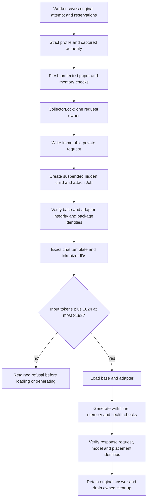

# Model admission and resource ownership

Use this guide to investigate a refused role request, a profile mismatch, token/context admission, child lifetime, or interference with the financial engine. The [research worker](research-worker.md) owns attempts and charges. The transport owns a request's actual dispatch. An installed source change, a passing fixture, a readiness GET, and an enabled operating grant are different states.

## Transport and profile owners

| Owner | What it controls | What it does not establish |
| --- | --- | --- |
| [LocalRoles](source-index.md#model-local) | Existing local-service policy, runtime identity, qualification receipt and conservative preflight | Exact PEFT template token count or a PEFT child lifetime |
| [PeftDevelopmentRoles](source-index.md#model-development) | Source/config declaration, offline per-request native child, paper health observations | Paper proposal dispatch authority |
| [PeftPaperPilotRoles](source-index.md#model-pilot) | Strict current grant, selected policy, profile/contract identity, finite dispatch hook where required | New scanner acquisition, funding permission outside normal Lab gates, or general shell authority |
| [PEFT profile](source-index.md#model-profile) | Frozen context/output/resource/decoding settings and loader identity | Hardware optimum or measured safe concurrent financial workload |
| [ResearchResources](source-index.md#model-runtime-resources) | Fresh supervisor identity, executable and birth time, priority/affinity observations for the legacy runtime | Model quality or a complete inference admission |
| [ChildOwner](source-index.md#model-child-owner) | Exact suspended child, Windows Job attachment, RSS observations and handles | Absence of unrelated OS processes |

The current PEFT profile specifies CPU float32, two threads, background priority, context 8192, output reserve 1024, request timeout 600 seconds, a 24 GiB child memory envelope and an 8 GiB available-memory reserve. It also supplies hourly wall/token allowances. These are selected profile limits; describe them as configuration, not measured hardware maxima. Metadata validation and small file hashes do not prove that current private model weights were freshly loaded and verified.

## Grant formats and dispatch authority

[Grant parsing](source-index.md#model-grant) strictly accepts the keys of each format. Role contract version, pilot grant format, and question policy are independent identities.

| Grant format | Required role grammar/policy distinction |
| --- | --- |
| v1 | Reviewed-rule role grammar v5 |
| v2 | Tool-request grammar v6 |
| v3 | Capability grammar v7 |
| v4 | v7 grammar with `evidence-question-selection-v1` |
| v5 | v8 grammar with `pattern-question-selection-v1` |
| v6 | Same saved-pattern policy plus strict finite test scope |
| v7 | v8 grammar with `outcome-conditioned-pattern-question-v1` |
| v8 | v8 grammar with `bounded-pattern-method-question-v1` and exact method-policy SHA |

[Selection authority](source-index.md#model-selection-authority) captures grant, profile, grammar and question policy; method grants add the method-policy SHA. [Instance preflight](source-index.md#model-instance-preflight) and [dispatch](source-index.md#model-pilot-infer) recheck current authority, including a grant that changes after initial preflight. Do not treat an absent authority as a fallback to an old grant or interpret a saved task under the current grant merely because its name matches.

Only finite v6 accepts `finite_test`: exact native BTCUSD/5m finding selection, `not_before`/`expires_at`, at most 30 hours, and exactly three total reserved requests. [FiniteRoleTest](source-index.md#research-finite-owner) binds one root and its allowed stages. Ordinary hourly allowances do not enforce a total-call or single-chain experiment. A finite v6 scope cannot represent the later two-method policy without a separately reviewed capability and authority decision.

The [finite dispatch hook](source-index.md#model-finite-dispatch) claims the original reserved attempt once before child creation and performs nonclaim checks after ownership, before resume, and during inference. The worker hook runs outside the transport policy mutex. [Finite operation](source-index.md#model-finite-operation) gives existing financial admission a cheap exact-scope/time guard while its writer lock is already held; it must not acquire the registry inside that context. Pause and expiry refuse new work, while existing committed-trial reconciliation remains recoverable. An admitted commit can drain past expiry; this is not a physical commit-deadline guarantee.

## Actual PEFT request lifetime

[Development dispatch](source-index.md#model-development-infer) uses a fixed `python -m trading.peft_role_runner JOB`, `shell=False`, an offline environment and hidden Windows child. It attaches ownership before the suspended launcher resumes, constrains placement, samples memory, checks available reserve, bounds child logs and periodically observes protected paper health. The original response is retained even if the protected guard closes as generation ends; retention does not authorize a subsequent financial action.

[Runner generation](source-index.md#model-runner-generate) first verifies package, base-model and adapter integrity, then renders the full system and serialized packet with the frozen tokenizer chat template. Its actual token check is **input IDs + 1024 <= 8192**, before base/adapter weight loading, tensors or generation. It does not silently truncate evidence. The removed 32768-byte prompt admission is not a current PEFT context guard. UTF-8 byte diagnostics are useful to inspect payload size; bytes are not tokenizer tokens.

The 32768-byte final-answer limit in the [worker attempt owner](source-index.md#research-worker-answer) is a separate response/archive bound. The child log and metadata bounds are separate bounded-I/O controls. Do not remove all occurrences of a number merely because one historical prompt proxy was removed.

[Child cleanup](source-index.md#model-child-close) closes only its known handles and reports failures. Procedural-child tests establish source and owner behavior. They do not establish that a real model ran, that a whole OS cohort was inventoried, or that a particular machine can sustain the profile while financial work remains timely.

## Legacy byte proxy and qualification

[LocalRoles preflight](source-index.md#model-local-preflight) sums system/schema UTF-8 bytes, packet bytes, output reserve and a template reserve against `num_ctx`. That is an explicitly conservative legacy proxy, not the PEFT runner's tokenizer. Its [qualification owner](source-index.md#model-local-qualification) requires frozen holdout case/seed receipts with the source-defined pass criterion; those criteria are selected qualification policy, not economic performance.

The local-service path verifies its supervisor/runtime identity, CPU placement, response completeness and actual model digest. PEFT uses an owned offline child and exact adapter/runner identities. A test fixture inheriting `LocalRoles.preflight` can create an artificial byte refusal if it is meant to exercise PEFT; use the actual PEFT preflight and record bytes as diagnostics without inventing token measurements. [Next-method tests](source-index.md#research-tests-next-method) cover that caller distinction.

## Resource and timing guard interpretation

[EngineWorkPressurePolicy](source-index.md#model-engine-pressure) uses observed completed engine-work durations and explicit monotonic observation continuity. Its source labels the parameters uncalibrated: 100 ms is advisory; repeated >=500 ms work and >=1000 ms severe work can constrain optional research. Recovery needs the source-defined fresh consecutive observations, elapsed span and severe hold. A wall snapshot alone cannot prove an uninterrupted recovery sequence or diagnose the cause of an elapsed transaction.

[Tiered runtime admission](source-index.md#model-tiered-constraint) combines pressure with disk reserve, capture failure and financial readback availability. [Numerical resource placement](source-index.md#model-numerical-resources) bounds the existing numerical child; it is separate from the PEFT profile and from inference grants. Preserve independent position management, marking, accounting and scoring when optional research is blocked.

When investigating a refusal, classify its basis before changing it:

| Basis | Example | Appropriate evidence |
| --- | --- | --- |
| Structural or measured incompatibility | Wrong profile/adapter, actual token count above context, closed owner, missing fresh financial observation | Exact identities or actual observation, with unavailable states retained |
| Selected resource envelope or recovery policy | Memory reserve, child timeout, thread placement, engine-work thresholds | Configuration and relevant measurements; do not claim optimal calibration |
| Experiment authority | Enabled grant, allowed roles, three finite attempts, expiry, current method SHA | Exact human scope and durable grant/attempt ledger; speed does not widen authority |

## Change checks and missing evidence

For a token refusal, begin with [loader contract tests](source-index.md#model-tests-loader) and [preflight tests](source-index.md#model-tests-preflight). The mocked 7168/7169 full-template boundary proves that generation is admitted/refused at the right software boundary; it is not a real tokenizer or model run. For lifecycle and placement, use [child owner tests](source-index.md#model-tests-child), [child resource integration tests](source-index.md#model-tests-child-resources), and [failure receipt tests](source-index.md#model-tests-failures). For schema and authority, inspect [next-method grant tests](source-index.md#model-tests-method), [learning grant tests](source-index.md#model-tests-learning), and [finite pilot tests](source-index.md#model-tests-finite).

Historical tokenizer counts apply only to their frozen original packets, tokenizer, template and profile. They cannot certify a new method packet or actual reasoning quality. Current source tests cannot certify live memory/latency, after-cost results, grants, private weights, installed state, or model activation. Follow the [verification guide](verification.md) for the explicit next proof stage; do not bypass guards or dispatch a provider merely to populate the map.
