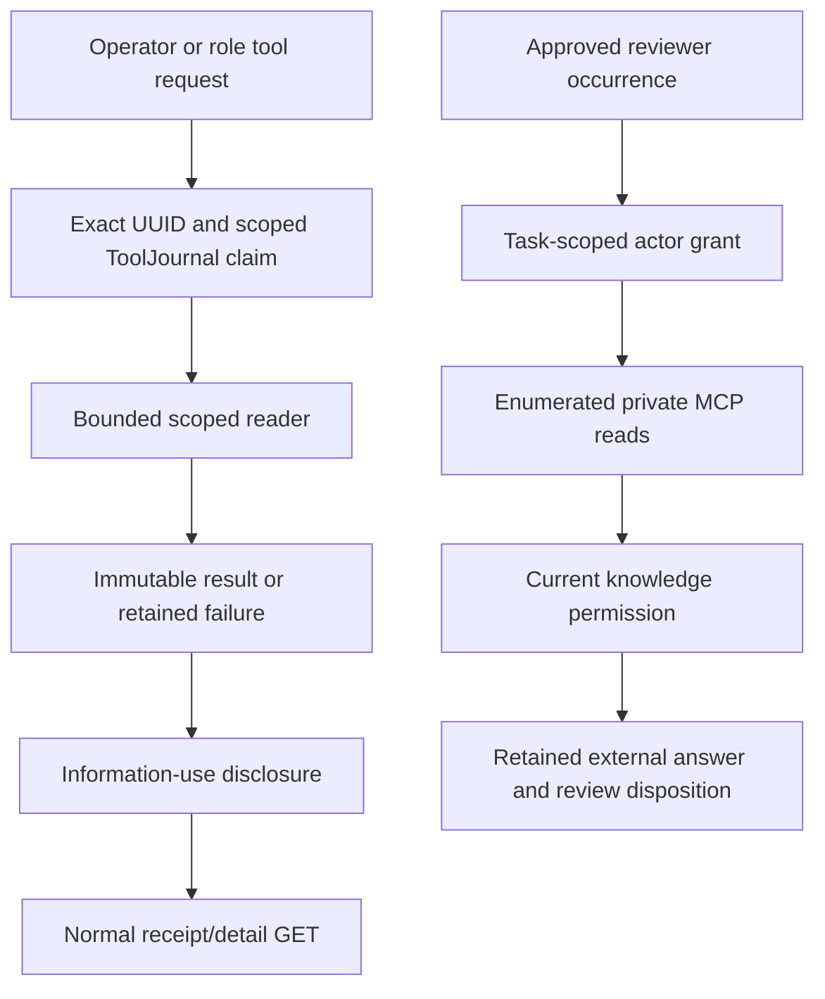

# Oversight, scoped tools, and reviewer knowledge

Use this guide to add or repair a research tool, investigate a lost acknowledgment, inspect a review occurrence, or change a normal oversight surface. The tool surface is deliberately enumerated and scope-bound. It does not expose generic SQL, shell commands, arbitrary filesystem operations, account mutation, or open-ended network authority.

## Two tool surfaces and their owners

| Surface | Owner | Scope and effects |
| --- | --- | --- |
| Local operator/role evidence tools | [scoped_tools](source-index.md#oversight-scoped-tools), [ToolJournal](source-index.md#oversight-tool-journal), [station dispatch](source-index.md#oversight-station) | Exact tool/symbol/account/query UUID; bounded evidence read plus durable receipt and information-use disclosure |
| Private research MCP | [ResearchMCP](source-index.md#oversight-mcp), [ResearchActors](source-index.md#oversight-actors), [ResearchReviews](source-index.md#oversight-reviews) | Task/review-scoped actor token, request/output allowances, current permission and revocation |
| Optional external reviewer | [ResponsesReviewer](source-index.md#oversight-provider) | Explicit provider/data/spending/profile/schedule approval; immutable occurrence and bounded provider/tool turns |

The [API tool route](source-index.md#oversight-api-tool) validates the scope before dispatch. [Actor/MCP wiring](source-index.md#oversight-api-mcp) uses the existing owners. Adding a tool name in a UI or a model's suggested text is not enough; its strict schema, reader, journal, exposure and permission paths must agree.

## Scoped local evidence and UUID recovery

[Scoped execution](source-index.md#oversight-tool-run) reads the selected research account and captured cutoff. Production PostgreSQL reads use a separate authenticated repeatable-read, read-only transaction; diagnostic queries set their own bounded statement timeout. An absent selected account refuses without primary-account fallback. Explicit disposable stubs have a declared absence of a permanent financial journal.

The existing tool families include `market_evidence`, `outcome_review`, `input_diagnosis`, and `cost_diagnosis`, with other enumerated station tools handled by [station.execute_tool](source-index.md#oversight-station). Tool results distinguish observed native candles, warmup, gaps, omissions, cost groups, trial/account and availability. A receipt is not a complete-history claim, a tokenizer count, a model answer, or an account fill.

[ToolJournal.start_once](source-index.md#oversight-tool-start) compares the full original query for a recovered UUID and returns whether work was newly created. Same UUID/different scope refuses. The journal can recover verified cold indexes without re-running the request. Its owned leases distinguish in-flight/interrupted work; detail/GET must not turn unknown completion into successful redispatch.

[Disclose](source-index.md#oversight-tool-disclosure) records the exact interval and result/request identity in `evidence_windows`. Legacy receipts lacking precise availability use a conservative exposure interval rather than declaring that no information was consumed. A read can therefore change research access metadata without being a financial mutation.

For role-origin tool waits, use the existing [role tool grammar](source-index.md#research-role-contract) and [worker dependencies](source-index.md#research-worker-maintenance). A tool answer supplies evidence for a retained continuation; it does not execute a model-generated shell command or authorize a new method, grant or preferred outcome.

## Private MCP and actor allowances

[MCP tool inventory](source-index.md#oversight-mcp-tools) contains exactly:

- `review_get_packet`: the frozen review packet and digest.
- `knowledge_search`: permitted sections at the original review cutoff.
- `evidence_read`: a citation already in delivered review context, with current permission rechecked.
- `review_get_result`: the saved occurrence's state/result/reason.

[ResearchMCP.call](source-index.md#oversight-mcp-call) charges an authenticated attempt before argument hydration, then validates strict keys, task membership and actor authorization. Authenticated invalid attempts still consume the allowance. It charges output bytes and retains delivered knowledge receipts; the common encoded output branch has a 64 KiB bound. Frozen-evidence delivery follows its separate actor output allowance. Avoid claiming every branch has identical byte handling.

[ResearchActors](source-index.md#oversight-actors) owns explicit task grants, expiry, request/output counts, leases and revocation. Tokens are scoped credentials, not general application operator permission. A reviewer cannot enlarge its own tasks, grants, costs or tool inventory. [LocalMCPClient](source-index.md#oversight-mcp-client) is the adapter for this same local surface, not an alternate backend.

## Review occurrences and provider policy

[ResearchReviews](source-index.md#oversight-reviews) owns occurrence reservation, saved packet, budget, immutable reply/draft and explicit decisions/reconciliation. Its [ReviewerPolicy](source-index.md#oversight-review-policy) defaults disabled and requires separate external-data, spending, schedule-owner and supported-profile approvals. Daily timing and request/cost reserves are selected policy, not observed quality or provider prices.

[ResponsesReviewer.review](source-index.md#oversight-provider-review) verifies those approvals, issues a bounded task-scoped actor grant, uses the private MCP adapter and revokes the grant in `finally`. It checks discovered tools and the exact delivered packet before provider dispatch. A refused call before any provider turn is classified as not dispatched; after dispatch, the original attempt/result remains the evidence. Do not relabel an unknown provider acknowledgment as free/unspent or auto-retry it with a new identity.

Knowledge disclosed externally passes the [current permission owner](source-index.md#evidence-knowledge-permission). Review continuation and corrected research questions remain explicit existing owner paths; external model text cannot directly change financial rules or clear an adverse task outcome. [Research quality](source-index.md#oversight-quality) reports source-defined research observations, not after-cost strategy qualification.

## Normal oversight surfaces

| Consumer | What to inspect |
| --- | --- |
| [ResearchAttention](source-index.md#oversight-attention-panel) and [ResearchNotices](source-index.md#oversight-notices) | Current conditions, saved operational notices and original event dates; unavailable is not empty success |
| [ResearchActivity](source-index.md#oversight-activity) and [activity UI](source-index.md#oversight-activity-panel) | Evidence/source dates rather than poll-time activity; bounded owner reads |
| [ResearchActorPanel](source-index.md#oversight-actor-panel) | Exact task grants, ownership, renew/release and saved result |
| [KnowledgeWorkspace](source-index.md#evidence-knowledge-panel) | Original/current permission, citations and saved reviewer/knowledge dispositions |
| [RoleResearchPanel](source-index.md#research-role-panel) | Retained question/attempt/tool wait and same-UUID recovery; no fresh request when current mode is unavailable |
| [MarketStation](source-index.md#oversight-station-panel) | Selected symbol/account, bounded tool run and exact receipt; no implicit account fallback |

Saved pattern controls have a separate normal UI concurrency seam: [ScannerWorkspace](source-index.md#oversight-scanner-panel) shares cross-tab ownership for command UUIDs. A definite pre-mutation refusal queues only terminal local cleanup behind an existing Web Lock, then rechecks original payload/UUID before clearing. It does not queue another POST, change production revision guards, or invent a saved server receipt. The [scanner browser fixture](source-index.md#oversight-browser-scanner) holds the actual lock to test this ordering; source parsing alone does not prove browser lock behavior.

Saved comparison viewing uses [PatternComparisonPanel](source-index.md#research-comparison-panel) and exact UUID GET. It cancels a stale description read after successful explicit original adoption, so a late current-source refusal cannot overwrite a valid sealed original. A saved read-only preparation does not turn into supported dispatch when the current source changes.

## Recovery tasks and checks

| Symptom | Start here | Maintained checks |
| --- | --- | --- |
| Lost tool acknowledgment or repeated request | Original query UUID, journal running/cold reference, detail GET | [Scoped tool tests](source-index.md#oversight-tests-tools), [tool request tests](source-index.md#oversight-tests-role-tools) |
| Wrong account, stale cost/input result | Scoped reader cutoff/account/trial and gap metadata | [Strategy diagnosis tests](source-index.md#oversight-tests-diagnosis), [activity reader tests](source-index.md#oversight-tests-activity) |
| MCP citation absent or permission revoked | Delivered receipt, original cutoff, task membership, current knowledge disposition | [Actor tests](source-index.md#oversight-tests-actors), [knowledge tests](source-index.md#evidence-tests-knowledge) |
| Review interrupted, budget refused or unknown provider completion | Original occurrence/reservation/provider turns and explicit reconcile | [Review repair tests](source-index.md#oversight-tests-reviews), [background review tests](source-index.md#oversight-tests-review-background) |
| Paused scanner retains an unknown Start after definite 409 | Exact original payload, terminal refusal and cross-tab local lock | [Scanner browser](source-index.md#oversight-browser-scanner) and [retained refusal recovery review](../reviews/SCANNER_REFUSAL_RECOVERY.md) |
| Valid original comparison shows late current error | Exact GET/read-generation cancellation before receipt publication | [Comparison browser](source-index.md#research-browser-comparison), [API tests](source-index.md#research-tests-comparison-api) |

Use [verification](verification.md) for affected source/disposable checks. Enumerating tests and reading current source do not certify a fresh provider run, installed runtime, whole native process cohort, direct network topology, scanner acquisition, permission to send private data, or an economic result.
