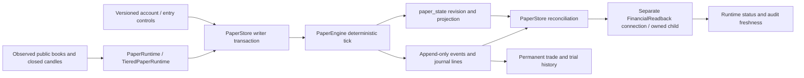
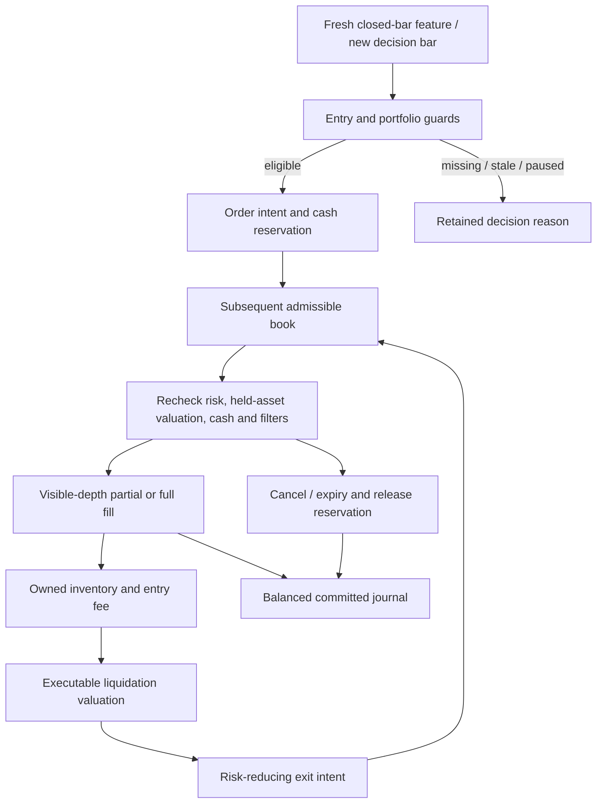

# Paper accounts, execution and accounting

This guide maps the checked-out source. Source declarations and linked tests describe contracts and coverage; they do not establish the installed revision, a completed test run, live venue permissions or a trading edge. Read the current `AGENTS.md` before changing an operating owner. Money and quantities cross application boundaries as decimal strings.

## Owner map

The spot financial authority is [PaperStore](source-index.md#paper-store), backed by PostgreSQL. A session advisory lock identifies the sole writer for the database/schema. Its transaction lock serializes controls and ticks; a row lock protects the singleton projection. [PaperEngine](source-index.md#paper-engine) computes deterministic changes, while [PaperRuntime](source-index.md#paper-runtime) supplies observed books and closed candles. [TieredPaperRuntime](source-index.md#tiered-paper-runtime) adds streaming, public-data fallback, recording, resource priority and separate readback. Public-feed adapters and scanner chart consumers are mapped in the market guides.

| Owner | Authority and retained output |
| --- | --- |
| [PaperStore transaction](source-index.md#paper-store-transaction) | One commit appends events/journal lines and updates projection/revision. Precommit exceptions/refusals roll back tentative effects; unknown commit acknowledgment requires exact original reconciliation. |
| [PaperEngine emit](source-index.md#paper-engine-emit) | Checks per-asset journal balance before adding an event; diagnostic events retain their purpose. |
| [ExecutionProfile and walk_book](source-index.md#paper-execution) | Frozen fee/slippage/participation/latency/expiry assumptions and visible-depth arithmetic. These are paper scenarios, not verified account fees or maker queue simulation. |
| [Reconciliation](source-index.md#paper-reconcile) | Checks event asset balance and projected cash, reservations, inventory, fees and fake funding, including archived accounts. Reports discrepancies; does not repair them. |
| [FinancialReadback](source-index.md#financial-readback) | Separately authenticated read-only connection; completed audit uses repeatable-read, read-only transaction. Optional recent/storage refresh failures cannot erase an already completed negative audit. |
| [ReadbackWorker](source-index.md#financial-readback-worker) | Owns child, pipe, deadlines and cleanup. SQL cancellation is not proof that the child or SQL work drained. |
| [Trade history](source-index.md#paper-trade-history) | Reconstructs closed trades from permanent events and shows current open positions with qualified executable marks. |

## Account identity and purpose

Each account owns its cash, funding, fees, positions, pending orders, cooldown, risk state and attempts. Sharing a book or feature computation does not pool capital. [Initial state](source-index.md#paper-initial-state) creates primary and three original variant peers; the [universe comparison](source-index.md#paper-universe-pair) separately funds control/wide accounts. This yields the six original spot identities recognized by the Lab schema. Account totals later depend on explicit campaign, forward, Lab and diagnostic admissions and on ordinary retirement; an archive count is not a running-account count.

| Account class | Creation / continuation | Research boundary |
| --- | --- | --- |
| Original primary and peers | [Account constructor](source-index.md#paper-account), seed funding, original universe pair | Their attempts and losses remain; original flat-account rule changes use a separate versioned control. |
| Ten/fourteen-account campaign | [Campaign creation](source-index.md#paper-campaigns) | Frozen account contracts, own funding and controls; bounded total capacity. |
| Forward numerical challenger | [Challenger admission](source-index.md#paper-challenger-admit) | Frozen artifact and cost assumptions, separate forward account; no automatic primary designation. |
| Autonomous Lab candidate/reference | [Lab finance](source-index.md#lab-finance-reserve) | Matched trial, separate funding, fixed outcome horizon and ordinary retirement archive. |
| Performance diagnostic | [Diagnostic lifecycle](source-index.md#paper-diagnostic-lifecycle) | Real paper accounting retained, but excluded from research labels, economics ranking, training and promotion by [purpose validation](source-index.md#account-purpose). |
| Options replay | [OptionsStore](source-index.md#options-store) | Separate schema and historical replay owner; see [secondary research](secondary-research.md#options-replay). |

Purpose is structured authority. The [purpose/provenance checks](source-index.md#account-purpose) defend reserved diagnostic identity/version even if a marker is absent or altered. Mixed financial archives can contain diagnostic neighbors without tainting a separately verified research target. A label, note or prose mention does not convert a diagnostic run into research evidence.

## Closed-bar decisions and order lifecycle

[Minute parsing and baseline features](source-index.md#paper-strategy) reject inconsistent OHLCV, repeated/reordered bars and incomplete candles. Features require a causal contiguous warmup and fresh last close. The legacy baseline uses closed-minute input with complete five-minute trend groups, ATR, breakout and volume checks. [Replacement-bank features](source-index.md#redesign-strategy) and [reviewed RuleSpec features](source-index.md#rule-feature) are explicitly versioned alternatives. A retained feature label is not a fill.

[Entry](source-index.md#paper-engine-enter) checks the global/account pause, current valuation, hard stop, daily stop, cooldown, feature availability, spread, execution-cost hurdle, cash, exposure/risk ceilings, turnover and venue lot/price/notional filters. The movement-versus-cost hurdle is a deterministic admission proxy, not an expected-return forecast. Decision-bar deduplication in [tick_account](source-index.md#paper-engine-tick-account) prevents the same signal from creating repeated entries.

[Fill](source-index.md#paper-engine-fill) rechecks the full held portfolio and the subsequent book, rather than trusting an earlier fresh flag. `walk_book` applies adverse slippage, tick rounding and visible-depth participation. USD fee payment is the supported assumption. [Cancel](source-index.md#paper-engine-cancel) releases the remaining reservation without inventing a fill. Order acknowledgments, touched prices, missing intervals and local timeouts do not prove execution.

[Position management](source-index.md#paper-engine-exit) values holdings and handles existing exits before adding risk. Missing executable depth can block purchases while still allowing an available partial risk-reducing exit. A paused entry policy does not waive ownership, cash or risk checks and does not fabricate liquidation.

## Valuation, stops and attempts

[Value](source-index.md#paper-engine-value) uses owned cash and executable liquidation of holdings, including exit fees/slippage. Missing held symbols or insufficient depth produce incomplete valuation; the last equity can remain visible with stale qualification. Its observation time is not refreshed merely by reading the account. Funding is unitized so injections do not count as performance.

The default [hard-stop policy](source-index.md#paper-risk-policy) is cash-spot hard-stop v1. Its drawdown stop retains the original reference; [recovery](source-index.md#paper-risk-recovery) requires the exact stop, fresh complete valuation and equity strictly above the existing recovery boundary. Recovery does not replenish money, reset failure history or erase daily/cooldown controls. Unknown explicit policies refuse.

[Failure review](source-index.md#paper-failure-review) retains the policy distinction:

- New hard-stop accounts record the failed attempt and review without fake replenishment.
- Historical legacy-review accounts can retain the earlier strictly-below-$5, fresh-and-flat reviewed fake replenishment path. It journals funding separately, keeps losses/fees/history and applies cooldown. Do not reinterpret a legacy account from its current balance alone.

[Periodic review](source-index.md#paper-engine-review) compares two matched complete whole-account windows under unchanged capital, costs, funding and risk assumptions. It can change an eligible legacy primary while flat; bank replacements are protected from that legacy substitution. Correlated shadow windows are not independent profitability proof. The stronger forward designation policy is mapped separately in [strategy experiments](strategy-experiments.md#forward-qualification-and-designation).

## Atomic storage and cold recovery

[PaperStore initialization](source-index.md#paper-store-initialize) creates seed state/funding only through the writer and does not overwrite an existing projection. The append-only event/journal tables hold financial history; bounded summaries in projection are not a substitute for permanent rows. [Transaction commit](source-index.md#paper-store-transaction) checks invariants before publishing the next revision and records exact event references. Optional authorization callbacks are checked at lock acquisition, before journal append and after projection update so refusal rolls back new effects.

The bounded owner-only RAM cache is an immutable serialized optimization checked against database revision, `xmin` and `ctid` under the row lock. It is disabled for readers and invalidated on failure/unknown acknowledgment. [Cache tests](source-index.md#paper-cache-tests) cover same-revision external change, savepoint rollback and lost commit acknowledgment. Current DB projection and journal remain authority.

[Projection compression](source-index.md#paper-projection-compression) is a preview-by-default operator helper. Apply requires the ordinary writer stopped, expected compression metadata, supported server method and preservation checks under lock. It changes future projection storage, not financial event semantics. This guide does not authorize running it.

[Tiered audit acceptance](source-index.md#tiered-audit) preserves a confirmed negative reconciliation and stops normal financial operation rather than masking it with an ancillary refresh failure. An unavailable/stale readback is different from a confirmed imbalance; optional research is constrained by health/freshness. Reconnect and owned-child recovery do not create another financial writer.

Permanent [export](source-index.md#paper-export) uses forward event-ID pagination; [trade history](source-index.md#paper-trade-history) includes retired accounts. Closed trade rows combine actual partial exits. Missing/ambiguous original fills leave entry prices unknown instead of inventing them. Open trade marks require current executable inputs and explain unavailable P&L.

## Recorded capture and causal execution replay

[ExecutionWindow](source-index.md#paper-execution-window) is an optional finite capture request owned by the existing EvidenceRecorder, not a new financial engine. It reads bounded `execution-window-request.json` and retains `execution-window-status.json` beside the capture path. The request selects a 2,700-second window; starting requires a fresh BTCUSD book, at least 305 continuous causal minute bars and available feature provenance. The recorder attaches the original pre-tick operations, state, dispatch order, decision inputs and committed financial receipt to selected decision packets in its existing archive.

Capture must preserve consecutive financial revisions and observations no more than five seconds apart. Restart, missing required input, queue/archive refusal, storage protection or the finite record/byte limit leaves an incomplete request. The `captured_pending_reconciliation` state requires the separate [original-window audit](source-index.md#evidence-recorded-window); a status file or elapsed horizon alone does not establish complete capture. Auxiliary sampled-wire omissions are reported separately from required tick continuity. A complete no-trade audit still does not prove representative fills or improved market execution.

[checked_packet](source-index.md#paper-replay-packet) verifies immutable input hashes, applicable original engine/rule/profile source, causal feature reproduction and recorded financial outcomes. [run_replay](source-index.md#paper-execution-replay) processes at most 32 frozen decisions through PaperEngine in the optional isolated replay child. It first reproduces exact state, ordered events and balanced journal effects; a baseline mismatch withholds changed scenarios. A chronology, source or state-chain boundary stops the supported slice instead of resetting accounts or inventing intervening fills.

Only after baseline reconciliation does replay compare the recorded execution with the fixed delay and condition-cost stresses. Fees/spread/slippage remain embedded once, original inputs are not mutated, and diagnostic-purpose events remain excluded from research results. Observed bid paths omit between-book extrema; stresses are modeled assumptions, not measured venue behavior or prospective edge. The [replay owner and retained request lifecycle](evidence-storage-training.md#memory-and-research-families) handles queue, resources, interruption and original receipt recovery.

[Window tests](source-index.md#paper-execution-window-tests) cover disabled-by-default capture, gaps, restart, queue/status failures and the synthetic no-trade horizon. [Replay tests](source-index.md#paper-execution-replay-tests) cover exact baseline, withheld scenarios, source/feature corruption, pending uncertainty across gaps and retained child failures. These links identify covering tests; this map change does not execute them or authorize a capture request.

## Controls and fault isolation

[Original strategy change](source-index.md#account-strategy-change) accepts only original identities, exact expected strategy/control version, flat/no-pending state and resolved execution/valuation/fault state. It records a receipt and changes future rule selection without changing cash, funding, fees, realized history or risk ceilings. Lab and campaign contracts remain frozen. [Runtime receipt recovery](source-index.md#account-strategy-receipt) reopens the exact original acknowledgment after loss instead of issuing a new change.

[Campaign tick isolation](source-index.md#paper-engine-tick) rolls back a failing campaign/diagnostic account's tentative state/events while healthy siblings can proceed; pre-existing financial corruption still stops the whole writer. Fault recovery must not erase uncertainty or release unowned funds. Global and per-account entry pauses have separate purposes; hard stops have their own exact recovery contract.

## Troubleshooting from retained evidence

| Symptom | Inspect first | Interpretation / next source task |
| --- | --- | --- |
| Balance shown but entries do not run | [entry_reason](source-index.md#paper-entry-reason), feature reason, held-frame freshness | Trace the exact refusal; a displayed equity is not necessarily executable/fresh. |
| Buy pending or canceled without trade | [fill](source-index.md#paper-engine-fill), intent/cancel journal | Check subsequent book identity/time, remaining reserve, fees and filters; do not count intent as exposure. |
| Account vanished from active view | [archived account](source-index.md#paper-archived-account), [Lab retirement](source-index.md#lab-finance-retirement) | A flat completed trial can retire normally; inspect permanent score/history, not active-count arithmetic. |
| Audit unavailable or negative | [readback](source-index.md#financial-readback), [tiered acceptance](source-index.md#tiered-audit) | Distinguish deadline/connection/optional refresh from completed imbalance. Do not infer SQL holder identity from a TCP tuple. |
| Lost change acknowledgment | [strategy receipt](source-index.md#account-strategy-receipt) and expected version | Recover original request; changed inputs are not permission to repeat a control. |
| Diagnostic results appear in research | [purpose checks](source-index.md#account-purpose), [exclusion tests](source-index.md#diagnostic-exclusion-tests) | Verify structured selected-target provenance, not a label or archive neighbor. |
| Window captured or replay refused | [ExecutionWindow](source-index.md#paper-execution-window), [packet checks](source-index.md#paper-replay-packet), [original-window audit](source-index.md#evidence-recorded-window) | Inspect exact revision/input/archive boundary and baseline first; incomplete capture or intent is not a fill. |

## Covering tests and limits

| Contract | Source tests to inspect |
| --- | --- |
| Sole writer, atomic rollback, restart/journal reconciliation | [Store tests](source-index.md#paper-store-tests) and [exact receipt test](source-index.md#paper-commit-receipt-test) |
| Pending fill freshness, partial risk exits, unchanged stop recovery | [Risk tests](source-index.md#paper-risk-tests) and [risk/store tests](source-index.md#paper-risk-store-tests) |
| Consistent read-only audit, outage recovery and negative-audit priority | [Readback tests](source-index.md#financial-readback-tests) |
| Permanent partial-exit and retired trade rows, unknown fill prices | [Trade history tests](source-index.md#paper-trade-history-tests) |
| Preview/apply preservation and authoritative RAM fallback | [Projection tests](source-index.md#paper-projection-tests), [RAM tests](source-index.md#paper-cache-tests) |
| Flat-account redesign, exact lost acknowledgment and frozen Lab controls | [Account redesign tests](source-index.md#account-redesign-tests) |
| Diagnostic accounting retained without research contamination | [Exclusion tests](source-index.md#diagnostic-exclusion-tests) |

These are source coverage pointers. PostgreSQL fixtures require an explicitly configured disposable test database; synthetic books/clock advances are software evidence. Current account counts, installed health, real recorded coverage, financial ownership, storage capacity and operating permission require their own retained observation/approval evidence.
