# Research worker, proposals, and learning

Use this guide to change question selection, a role task, an attempt, a proposal handoff, or mature feedback. It maps source behavior; it does not establish that a model is enabled, that a particular installation contains this source, or that a strategy has an economic advantage. For inference admission, continue to [Model admission](model-admission.md). For cold payloads and permissions, continue to [Evidence, storage, and training](evidence-storage-training.md).

## Owners and authority

| Concern | Owner and entry point | Boundary |
| --- | --- | --- |
| Durable task, stage, lease, original model attempts | [RoleWorker](source-index.md#research-worker) | Advisory research; its proposal still needs the existing Lab and financial owners. |
| Research registry and events | [ExperimentRegistry](source-index.md#research-registry) | SQLite evidence and coordination, not a paper account connection. |
| Strict model answer grammar | [lab_role_contract](source-index.md#research-role-contract) | Valid syntax does not make an unoffered method executable. |
| Current grant, profile, and dispatch | [PeftPaperPilotRoles](source-index.md#model-pilot) | A question policy and an installed source change do not enable a grant. |
| Issued bundle and shared proposal inbox | [LabProposals](source-index.md#research-inbox) | All proposal producers use this owner; do not add a parallel submit queue. |
| Original saved scanner finding and comparison preparation | [PatternComparisons](source-index.md#research-pattern-comparisons) | Original native recognition and separately current executable inputs have different identities. |
| Archived tasks and attempts | [RoleHistory](source-index.md#evidence-role-history) | Verified reopening, preserving answered attempts and reservations. |
| Mature financial feedback | [ResearchLessons](source-index.md#research-lessons) | Records the actual scored outcome, including adverse, incomplete, and unknown facts. |

[API wiring](source-index.md#research-api-wiring) supplies the live recorder's storage callback and the shared comparison owner. The comparison routes refuse a cached owner tied to a different scanner or registry. Replacing one fixture owner without its peers is not a valid integration setup.

```mermaid
flowchart LR
  Q[Explicit question or policy-selected finding] --> W[RoleWorker task and lease]
  W --> A[Frozen attempt and allowance]
  A --> T[Transport admission and inference]
  T --> E[Deterministic candidate and reference evaluation]
  E --> H[Verified evaluation archive]
  H --> R[Reviewer answer]
  R --> I[Existing LabProposals inbox]
  I --> F[Existing financial admission and paper pair]
  F --> O[Available mature scored event]
  O --> L[Followup and immutable lesson]
  L --> Q
```

The last arrow requires the selected question policy and exact predecessor evidence. It is not an automatic permission to change a financial rule, reuse a foreign grant's lesson, activate a model, or acquire scanner history.

## Task stages and durable recovery

The [worker step](source-index.md#research-worker-step) claims an eligible task with an owned lease, validates its captured mode and authority, then advances the following stages. Its [run loop](source-index.md#research-worker-loop) is the existing scheduler; new research behavior belongs here rather than in another background service.

| Stage | Result and recovery seam |
| --- | --- |
| `idea` | A validated answer can end with `no_change`, wait for data or a scoped tool, or choose one offered proposal. Invalid or unoffered answers remain retained failures. |
| `evaluate` | Current candidate and reference use matched deterministic inputs. The evaluation is evidence, not an account fill or prospective result. |
| `archive_evaluation` | [Archive evaluation](source-index.md#research-worker-archive) appends and reopens the full payload before publishing compact hot fields and the review stage. |
| `review` | The original reviewer answer can refuse. Only the allowed exploratory verdict reaches submit. |
| `submit` | Normal idempotent inbox submission; financial validation and capacity remain authoritative. |
| `outcome` | Waits for the exact trial's available scored event. It does not substitute a later favorable event or a polling timestamp. |
| `followup` | Keeps the original result, records mature feedback, and can support a policy-bound later question. |
| `data_wait` / `tool_wait` | Existing dependency resolution creates bounded continuation with original lineage. An unknown model completion is not retried as new work. |

[Maintenance](source-index.md#research-worker-maintenance) persists phase state and retry dates. Recoverable storage or input availability can wait; a programming failure is exposed. A failed archive has an [explicit retry path](source-index.md#research-worker-retry) that restores the verified original evaluation, uses the same archive reference, and does not regenerate its consumed idea answer.

[Shielded owned work](source-index.md#research-worker-owned) drains threaded archive or maintenance work on cancellation before its outer owner can release or close shared resources. Do not replace this with a detached thread or cancel-and-close sequence.

## Selection policies and fixed methods

The method policy now uses immutable `role_question_selections` as ownership of
each dispatch-capable method before inbox publication. A waiting or rejected p0
cannot be rebranded as a fresh p0 to seek a preferred verdict. A separate p1 can
proceed after a scientific rejection (`reject` with no issues or only
`unsupported_claim`) or an unleased tool wait/future data or outcome retry.
Runnable work and due followups retain priority. Failed/unknown work, unsafe or
invalid review issues and the strict finite one-chain policy still refuse this
continuation. The existing active-task and allowance bounds remain authoritative.

For a quiescent predecessor, the new task retains its immutable original
selection and observation at selection time, without asserting a supported lesson.
An already-scored tool wait preserves its exact outcome using the existing
lossless score projection. A dependency child resolves its selection through the
checked root, including when that root is archived. This also applies to inherited
mature lessons in read-only observation continuations.
Later resumption of that predecessor does not invalidate the independent task's
frozen packet. Its original method claim remains available only to its own
dependency lineage. For a scientific rejection the original verdict is rechecked.
Actual mature lessons keep their existing exact source/cost/protection checks.
Legacy repeated unfunded selections consume their method rather than hiding the
other method. Legacy active bindings can also resume after an independent method
publishes; their own method availability and frozen controls remain checked.
The unchanged-source retry delay belongs only to this nonfinite method policy;
legacy and finite dependency recovery keep their immediate event behavior.

Automatic selection examines at most 32 distinct retained candidate events across
seven recent daily captures. It skips unusable or duplicate top candidates while
retaining original availability, spacing, source exposure, native BTCUSD/5m and
current executable-input restrictions. A saved preparation wait is immutable:
recovery uses the existing separately retained current observation and publishes
one task for the original event. No model allowance is charged by selection.
The ordinary task surface distinguishes that old wait from current input evidence.

[Question](source-index.md#research-question) is a strict request schema with optional UUID, parent, and lesson. Automatic selections have additional immutable source and authority records. The [contract inventory](source-index.md#research-role-contract) and [method policy digest](source-index.md#research-method-policy) separate three things: answer grammar, current grant policy, and offered financial method mapping.

| Policy family | Source behavior to preserve |
| --- | --- |
| Legacy manual and evidence-selected questions | Existing packets, profile fingerprints, and request identities remain their own versioned contracts. |
| Saved-pattern selection | Exact daily snapshot membership, original event/level/archive reference, native timeframe and cutoff motivate a supported fixed hypothesis. Scanner breakout/retest recognition is not the same algorithm as the bank predicate. |
| Outcome-conditioned questions | [Prior binding](source-index.md#research-pattern-prior) binds an exact mature task/lesson/outcome under the same authority. Inherited carry is bounded and distinguishes the original mature source from the immediate predecessor. |
| Bounded method selection | [Pattern selector](source-index.md#research-pattern-selector) offers unused `p0` breakout-retest versus cost-breakout, then unused `p1` trend-pullback versus the same cost-breakout, using existing v4 medium-horizon methods. |
| All offered methods already used | A research-only later root requires verified own prior evidence, has no new offered proposal, and cannot waive a financial used-rule gate. Otherwise it waits. |

A foreign used `p0` can make `p1` the first available method; it does not provide a foreign lesson. An outcome under a finite v6 grant is not silently transferable to an outcome-conditioned or method grant. Full current authority and method policy identities are rechecked before publication and dispatch.

[Current-input checks](source-index.md#research-worker-current) and [numerical exposure](source-index.md#research-worker-exposure) protect consumed information. Fresh numerical publication records its actual input windows in the same transaction as its lease/CAS update. Protected or lost-lease failure leaves neither a new evaluation nor an orphan disclosure. [ResearchLessons access and selection](source-index.md#research-lessons) join the existing registry transaction, so a failed question publication can roll back lesson access and exposure together.

## Original packets and financial truth

[Role evidence projections](source-index.md#research-role-evidence) retain independent source hashes for original preparation, current numerical evaluation, native recognition, and prior scored outcome. Some mature packets use explicit references to fields in the same packet, differences, and removals to avoid duplicate scored bodies. Missing samples, nulls, numeric types, and sample-key collisions must reconstruct exactly. Hashing a detector's literal reason is a declared projection; the full original remains in its saved evidence.

The [attempt owner](source-index.md#research-worker-answer) persists the frozen profile, packet, reserved allowance, and raw answer before interpretation. A completed answer is reused only for the same frozen packet. Unknown completion remains unknown until its explicit recovery path; neither invalid answers nor adverse results refund a reservation or authorize a preferred answer. Context fit, schema validity, actual model reasoning, and after-cost performance are separate evidence stages.

[FiniteRoleTest](source-index.md#research-finite-owner) provides the existing one-root/three-reserved-request ledger for a strict finite v6 scope. It counts original attempt allowances, including consumed reservations when work fails before launch; it is not a successful-dispatch count. Its absolute expiry prevents new admissions; it does not guarantee that an already admitted database commit finishes before wall-clock expiry. Reconciliation of an already committed trial is distinct from new model, proposal, reservation, or funding authority. See [Model admission](model-admission.md#grant-formats-and-dispatch-authority).

## Normal surfaces and change checks

[RoleResearchPanel](source-index.md#research-role-panel) displays the current question mode, exact saved finding/preparation links, captured method controls and separately current input evidence. Initial or later unavailable role status disables new request IDs while retaining same-ID recovery. [PatternComparisonPanel](source-index.md#research-comparison-panel) reopens an immutable preparation through exact GET; public Prepare is an explicit UUID action and does not submit, fund, or call a model. A research-only saved preparation remains viewable without exposing ordinary write controls. [LessonPanel](source-index.md#research-lesson-panel) is the mature note and next-question surface; notes do not rewrite original scored facts.

Before changing a symptom, trace its current owner and original saved identity:

| Symptom | Read first | Relevant source checks |
| --- | --- | --- |
| Duplicate question, stale selected finding, wrong method | Selector, publication transaction, exact selection and authority | [Question selection tests](source-index.md#research-tests-selection), [learning tests](source-index.md#research-tests-learning), [next-method tests](source-index.md#research-tests-next-method) |
| Unknown answer, repeated inference, apparent refunded allowance | Frozen attempts and `_answer`, not a fresh request | [Worker tests](source-index.md#research-tests-worker), [finite tests](source-index.md#research-tests-finite) |
| Archive waits, cold retry refuses, recorder closes | Shared storage callback, archive reference, owned cancellation | [Archive owner tests](source-index.md#research-tests-archive-owner), [history tests](source-index.md#evidence-tests-history) |
| Proposal accepted but task still waiting | Exact inbox and trial event, then acknowledgment recovery | [Finite Lab tests](source-index.md#research-tests-finite-lab), [next-method engine fixture](source-index.md#research-tests-next-method) |
| Prior lesson absent or protected | Exact mature source, current authority, available time, exposure window | [Lesson tests](source-index.md#research-tests-lessons), [learning tests](source-index.md#research-tests-learning) |
| Correct backend result is unusable in UI | Current mode and captured method, immutable GET adoption, late reads | [Role pattern browser](source-index.md#research-browser-role), [comparison browser](source-index.md#research-browser-comparison) |

These links identify maintained test sources, not fresh pass receipts. Run only the affected checks in an explicitly scoped source/disposable environment under the [verification guide](verification.md). Database-backed cases require an explicit disposable PostgreSQL owner; absence and skips must remain visible. Do not infer model quality, autonomous operation, a completed full year of history, installed source, or an economic edge from deterministic fixtures or a source map.
