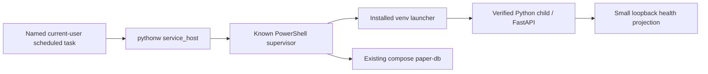
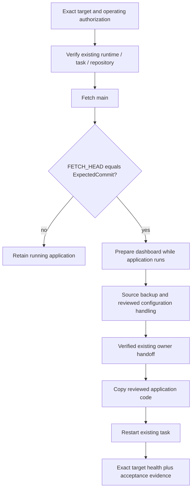

# Windows runtime, delivery and updates

## Process and task identity

[service_host](source-index.md#runtime-service-host) is a Windows-only windowless
owner for the paper or models PowerShell supervisor. It selects a known script,
uses `CREATE_NO_WINDOW`, records host/supervisor identity and propagates the
supervisor exit code. Its JSON/log is evidence to inspect alongside the actual
task, process birth, executable and command line; the record alone is not proof
that a process remains live.

[Run-PaperExperiment](source-index.md#runtime-paper-supervisor) owns the paper
supervisor mutex. It starts the existing compose `paper-db`, adopts only a verified
existing service, or starts `python -m trading serve --experiment`. It checks paper
health periodically and restarts only its verified worker/launcher on failure.
The [ownership helpers](source-index.md#runtime-process-ownership) validate launcher
and Python child identity. `Stop-OwnedServer` preserves unverified processes.

Use [startup-action identity](source-index.md#runtime-startup-identity) and
[controlled-update shutdown](source-index.md#runtime-update-shutdown) for their
respective handoff rules. Port ownership, task action, process ancestry and
PostgreSQL session ownership are different observations. A NAT port mismatch does
not establish which database session belongs to a Python worker. Leave unresolved
writer mappings false; never kill a guessed session.

Relevant coverage: [Windows supervision tests](source-index.md#runtime-supervision-tests),
[task/model runtime ownership tests](source-index.md#runtime-model-ownership-tests)
and [update shutdown tests](source-index.md#runtime-shutdown-tests). Those source
tests do not prove the workstation's current task/process identities.

## Updater target and preservation

[Update-QTrades](source-index.md#runtime-updater) validates the existing installed
task/runtime, required local data/Python, source repository, clean checkout and
approved full `ExpectedCommit` when supplied. The parameter is optional for legacy
compatibility; omitting it leaves the older unguarded target path reachable.
Approved exact-target rollouts must supply it. The updater's own fetch resolves
`FETCH_HEAD` and compares it with that supplied SHA before checkout/build/backup/shutdown. A mismatch
refuses the update; an older unguarded updater is not a substitute.

The updater source copies reviewed code and compiled assets, not a fresh account
database. Databases, credentials, private model/Lab artifacts, research evidence,
accounts/funding and financial prefixes require their existing preservation
procedure. Legitimately appended history stays appended. Do not restore old data
to manufacture an equality check or corrupt operating data for recovery testing.

After code copying starts, a copy/dependency/configuration failure can leave the
verified task stopped. The updater reports that state and its source backup;
inspect the exact failure and use the supported recovery procedure. It writes the
installed-commit marker before restart health is confirmed. Copied code or that
marker alone does not prove a successful restart or accepted installation.

[Simple updater tests](source-index.md#runtime-updater-tests) cover supported source
behavior and disposable failures; [health tests](source-index.md#runtime-health-tests)
cover the exact [health predicate](source-index.md#runtime-health-predicate).
The health helper checks service/mode/paper freshness/balance/error/code identity;
it does not replace populated-page acceptance, complete storage preservation or
direct writer ownership mapping. Use [local update instructions](../LOCAL_UPDATES.md)
for the full supported operating procedure.

## Launcher and native-product limits

The current [desktop launcher](source-index.md#runtime-desktop-launcher) and
[dashboard opener](source-index.md#runtime-dashboard-opener) are browser-launch
implementation paths. Inspect them before claiming a packaged native product.
They do not establish issue #65's independent installed-window, packaged backend,
installer/update and clean-machine acceptance. This code-map increment neither
changes that product boundary nor performs an operating update.

The models supervisor/runtime ownership path is separate from paper supervision.
Stopping a dashboard window does not imply paper or research workers stopped.
Starting or restarting operating workers, installing updates, selecting model
profiles or executing a model requires the applicable current authorization.

## Representative investigations

- **Update refuses a target:** compare approval SHA, fetched SHA and clean-checkout
  evidence. Retain the mismatch; do not bypass it to get a green install.
- **Health is unavailable or stale:** inspect current task/process identity and
  logs, then the health projection and paper runtime. Do not start a duplicate.
- **Window closes but work continues:** trace launcher → task → host → supervisor;
  use the intended entry pause/control rather than guessing that UI lifetime owns
  execution lifetime.
- **Installed behavior differs from a PR:** compare the source commit with the
  installed marker/health and the accepted receipt; merging is not rollout.
