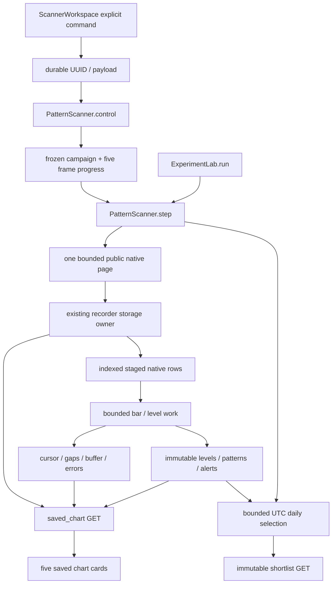

# Scanner, daily analysis and charts

This is a source map of the current checkout, not an operating scan or acceptance receipt. Pattern recognition, current descriptive evaluation, preparation-time numerical checks and later financial outcomes have different owners. Source links resolve through the generated [source index](source-index.md). See [Market data](market-data.md) for acquisition/freshness and [Dashboard and API](dashboard-api.md) for local controls and browser recovery.

## Four workflows with different scopes

| Workflow | Trigger and owner | Retention/read path | Bound and meaning |
| --- | --- | --- | --- |
| Standalone candle study | Explicit user Load; API tool journal | Original tool UUID/run, native archive and verified reopen | One market/frame/window, at most 5,000 bars and six pages; historical windows can be truncated |
| Year scanner | Explicit Prepare then Start; existing PatternScanner in Lab loop | Frozen campaign, per-frame progress, raw archived pages, every original level/event | All five native frames over a requested 365 days; resumable processing and explicit missing slices |
| Daily analyzer | Explicit Enable daily analysis; same scanner owner/persisted v2 policy | Immutable UTC-day shortlist, original evidence/coverage; current eligibility separately | Up to five research priorities, not five guaranteed recognized setups |
| Saved chart cards | GET when viewing existing campaign/market | Processed buffer or exact archived page, original overlays/selection | Five read-only native cards; no new study POST or venue fetch |

[CandleWorkspace](source-index.md#scanner-candle-workspace) remains a separate bounded tool. [ScannerWorkspace](source-index.md#scanner-workspace) mounts [ScannerChartGrid](source-index.md#scanner-chart-grid) for the selected saved campaign. Native bars are supplied by [PublicVenue.historical_candles](source-index.md#market-native-candle-venue), not fabricated from the legacy minute feed.

The actual call from [ExperimentLab.run](source-index.md#scanner-lab-loop) to `pattern_scanner.step()` is independent of the dashboard being open. Browser GET polling does not start that producer. A service running does not imply scanner enabled or fully prepared.

## Native study and exact receipt recovery

[load_history](source-index.md#scanner-native-loader) accepts native 5m, 15m, 30m, 1h and 4h intervals, aligns the cutoff to a closed native boundary, validates ordered native bars and refuses malformed/duplicate/forming/out-of-scope observations. Recent mode requests a short tail. Week/month/six-month/year windows can exceed the 5,000-bar study limit; the response must disclose truncation and actual/requested coverage. No resampling or gap filling supplies absent candles.

[analyze_history](source-index.md#scanner-native-analysis) applies the standalone analyzer. [retain_history](source-index.md#scanner-study-retention) archives raw candles, points and coverage in bounded chunks through the configured shared storage owner. [reopen_history](source-index.md#scanner-study-reopen) verifies the original manifest/chunks, scope and digest without refetching. A missing or changed artifact refuses instead of replacing an old result with today's data.

[ToolJournal.start_once](source-index.md#dashboard-tool-start-once) retains the request UUID and exact tool/market/account/query. [The API tool runner](source-index.md#dashboard-tool-runner) enforces one busy tool owner and its minimum interval, acquires asynchronously, and moves analysis/archive work off the event loop. The candle controller stores pending ownership before POST and reopens by the original UUID/run after an uncertain acknowledgment or reload. It does not POST automatically on mount. A GET 404 during pending work is an unknown result, not permission to send a new UUID.

## Detector definitions and causal knowledge

[analyze_candles](source-index.md#scanner-candle-analysis) computes display SMA10/50/100, a trailing-50 native HLC3/volume VWAP and a current-volume ratio against the **previous** 20 positive volumes. Incomplete warmup and zero denominators remain null. The current bar cannot contribute to its own volume baseline. Recorded volume confirmation requires a ratio of at least 1.5. The standalone analyzer retains at most 12 zones and 60 patterns; these display-study caps do not limit the year scanner's saved level/event set.

[Strict pivots](source-index.md#scanner-pivot-confirmation) require two bars on each side. A pivot becomes confirmed at the close of its second right bar and usable only afterward. Zone half-width is 0.0015 of the pivot price. [The visit recognizers](source-index.md#scanner-pattern-visit) use known levels:

- `support_bounce`: a separate support visit followed by a bullish close above the zone.
- `resistance_breakout`: the previous close is at/below known resistance and the new close breaks above it.
- `breakout_retest`: an earlier breakout, a full candle away from the level, then a later bullish retest/hold within the defined ten-native-bar interval.

Gaps reset contiguous indicator windows, usable detector state and segment warmup. They do not produce synthetic OHLCV or retrospectively move confirmation. Original events retain their level, time, reason and source identity. Recognized moves do not establish predictive accuracy, VWAP causation, an approved trade or financial winners.

## Frozen campaign and cooperative year progress

[PatternScanner.control](source-index.md#scanner-control-owner) freezes the observed eligible USD roster and the explicitly selected set. Unselected eligible rows remain queued/unprepared, not silently enrolled. Prepare creates all five requested native scopes, disabled. Start requires the exact current campaign and revision; Pause uses the exact campaign and increments revision so a delayed older Start cannot overtake acknowledged Pause. Existing request UUIDs recover the original receipt and reject changed payloads. Source/storage identity changes block fresh work. Retained manual v1 campaigns are disabled at startup; daily v2 has its separate persisted opt-in semantics.

Per market, requested 365-day coverage spans 168,630 native slots across the five intervals. Dense acquisition needs many native pages. A 5m year is not limited to the standalone study's 5,000 bars. [step](source-index.md#scanner-step-owner) admits one source page at a time, at most 1,000 rows, and records an attempt before awaiting it. Source errors do not advance the cursor; retries have a cooldown and a three-attempt bound at that cursor. Exhausted source work is explicitly blocked, not falsely complete.

[Retention](source-index.md#scanner-page-retention) borrows the existing writer, stores at most two 500-row chunks for a page and verifies references. [Staging](source-index.md#scanner-stage-owner) persists actual row/ordinal/hash and pending cursor. [Cooperative work](source-index.md#scanner-work-owner) processes at most 20 bars and 128 level updates within a bounded work slice; checkpoints survive restart without refetching the same retained page. Page cursor/counts advance only when that page's actual work completes. Every strict confirmed pivot is retained, including overlapping levels.

The registry keeps immutable campaign scope, control receipts, archived-page identities, original level bodies and events. Mutable progress and level visit state are separate. [snapshot](source-index.md#scanner-status-owner) returns only the first 100 progress rows with total/omitted/counts. [page](source-index.md#scanner-record-page) provides all progress, levels, patterns and alerts in bounded pages. Reaching the initial cutoff means a scope can monitor new closed bars even if history was sparse; `monitoring` alone is not proof that `missing_bars == 0`.

## Historical patterns and prospective alerts

During historical preparation, recognitions are `patterns` with historical labeling. After the initial scope reaches monitoring, fresh closed native bars can produce `alerts`, with the exact original event and [descriptive evaluation](source-index.md#scanner-alert-evaluation). Other frames can still be preparing or missing; one monitoring 4h scope does not complete an entire five-frame year.

Evaluation checks recorded freshness, volume/ATR support, eligibility, quote/spread, protected inputs and current execution-cost evidence. It retains `unknown`, `candidate` or `does_not_meet_criteria` with the actual reasons and observed inputs. Missing cost/book/coverage is not a zero cost or automatic pass. An alert is a descriptive research event, not an order, a measured future outcome or qualification.

## Daily shortlist and immutable source navigation

[The daily control branch](source-index.md#scanner-daily-control) accepts only explicit daily enable/pause with the existing UUID/revision controls. A first enable can replace an existing paused manual v1 campaign with a new v2 campaign; the immutable receipt binds `previous_campaign_id`. The UI must not compare the successor solely to mutable current status. Pause disables producer/campaign together. No symbols are accepted on daily controls, and mounting the daily panel does not enable it.

[Daily work](source-index.md#scanner-daily-work) captures a UTC-calendar-day roster, enrolls up to five new markets once, and requests all five full-year scopes. It rechecks eligibility and admission before publication. Bounded slices and per-market capture times are disclosed; this is not a simultaneous all-market photograph. There is no burst of missed-day backfill. Old day's rank/body is never rewritten when eligibility changes.

[Candidate construction](source-index.md#scanner-daily-candidate) and [priority](source-index.md#scanner-daily-priority) distinguish:

| Basis | Required source | Ranking meaning |
| --- | --- | --- |
| `recognized_setup` | Actual recent volume-confirmed original event in at least one prepared native frame | Source-backed setup priority; other frames and gaps still disclosed |
| `analyzed_no_setup` | At least one prepared frame, without a qualifying recent event | Analyzed evidence with no qualifying setup |
| `history_pending` | Insufficient prepared history | Liquidity-based initial research priority, not a pattern score |

Within those categories, actual quote volume, spread and a stable symbol tie-break determine ordering. All five coverage rows, prepared-frame count, event bodies and hashes remain captured. [Daily status](source-index.md#scanner-daily-status) exposes current roster separately from frozen picks and reasons for blocked, stale, selecting or history-pending states. [Exact snapshot](source-index.md#scanner-daily-snapshot) and [paged history](source-index.md#scanner-daily-pages) reopen immutable days. Empty history before explicit production is a legitimate state.

[DailyAnalyzer](source-index.md#scanner-daily-panel) restores `daily_shortlist`; an explicit historical selection stays pinned instead of following latest. “Try captured chart” uses the event's captured frame/progress identity and can truthfully refuse after progress advances. “Inspect current saved charts” is an explicit different read that clears all `scanner_chart_*` keys, even for the same campaign/market, while keeping the original daily metadata. Never remove a captured hash automatically after a refusal.

## Saved chart windows and overlay pagination

[saved_chart](source-index.md#scanner-saved-chart) reads the selected campaign/market/native frame. Latest mode contains at most 100 processed buffered bars. Historical mode opens one retained native page of at most 1,000 bars, verifies the declared storage plan and original chunk/page identities, and clips to actual completed processing. It performs no venue fetch or new study. Empty, partial, corrupt and unavailable sources remain explicit.

The projection recomputes **display indicators** from those saved bars, discarding recomputed analyzer zones/patterns. Levels, patterns and alerts always come from the original scanner records. Each overlay kind has at most 100 rows, its real total and cursor. A selected exact kind/sequence is separately recovered even when it lies beyond the first overlay page. Selection flags distinguish whether its candle exists and whether the record was known by the window end.

`at_ms` selects a saved page containing an event; `before_ms` selects an older page. They are mutually exclusive. Positive overlay cursors require `expected_progress_sha256`; progress changes refuse instead of mixing overlay pages or extending a partly processed historical page. Historical reload bookmarks retain that hash. A deliberate Latest read is fresh; it is not a replacement for an unavailable original historical window.

## Causal lines and chart rendering

[CandleStudyChart](source-index.md#scanner-chart-renderer) renders actual candlesticks/volume, disconnected non-null indicator segments and original event markers. All patterns on the same candle are grouped; the inspector retains every original name/reason/ID rather than choosing only the last event. Missing candles create timeline whitespace without filling OHLCV.

Support/resistance zone lines begin at actual first-usable knowledge and stay within contiguous native runs. A level confirmed inside a visible span can begin there after first usability. A level confirmed before the window extends only when its original segment matches a known scanner segment. Historical continuity can be unknown; the original record remains available without an invented horizontal continuation. Each boundary uses real first/last candle endpoints, preserving gaps. Dense levels have no per-series axis-title pileup; detail identifies the selected original level/price. The renderer draws the loaded overlay page, not every saved level at once.

The chart host has a fixed height (390 px normal, 290 px compact) with responsive width. This prevents `autoSize`/ResizeObserver vertical feedback and unstable ordinary Inspect buttons. `ScannerChartGrid` admits at most two GETs concurrently, aborts obsolete scope/frame generations and updates only the exact campaign/market request. Latest unpinned cards refresh every 30 seconds while visible; historical/paged cards do not. An unsuccessful new window keeps its previous successful `viewQuery`; old overlay controls are disabled on error rather than using new query scope with old cursors.

## Original finding to preparation handoff

[PatternComparisonPanel](source-index.md#scanner-comparison-panel) is a separate original-preparation viewer. Eligible immutable BTCUSD native-5m breakout/retest findings can be described read-only, then explicitly prepared under a durable UUID through the existing API. Preparation retains original finding/native proof and a separate preparation-time current numerical check. It does not submit an inbox item, fund an account or dispatch a model. The scanner detector and fixed strategy-bank mechanism are different; their mapping must remain explicit.

Saved preparation history and `pattern_comparison_request` reopen the exact UUID independently of current source availability. Normal p0 waiting records can be reviewed as a **separate** later observation only by explicit action/new UUID; the old wait is not upgraded. Internal saved p1 and `research_only` records bind method/mode intent, retain the appropriate fixed template, and offer no ordinary Prepare/new-observation/submit control. Later financial results belong to the experiment/outcome owners, not this preparation record. The viewer cancels pending ordinary descriptions only after a verified exact original adoption, so delayed source refusals cannot overwrite it.

## Incomplete or blocked year

Before changing scheduling or increasing bounds, inspect the exact campaign, requested cutoff, cursor, staged-page state, observed/expected/missing bars, gaps and source attempts. Read the complete progress page, not just the first 100 status rows. Distinguish waiting for admission, source-blocked, pending CPU work, paused and monitoring with missing historical slots. A chart only shows completed saved slots; a fetched page is not necessarily processed.

Source tests: [year scanner](source-index.md#scanner-year-tests), [daily analyzer](source-index.md#scanner-daily-tests), [native candle history](source-index.md#scanner-native-history-tests) and [storage borrowing](source-index.md#market-shared-storage-tests). These include actual synthetic native paging, persistent checkpoints, dense levels, year-beyond-study limits, source failures and cancellation. No test was run for this map.

## Missing overlays or refused historical link

Check original campaign/frame and event kind/sequence, overlay total/cursor, selected candle availability, level confirmation/first usability, native gaps and known segment identity. A missing line can be a causal restriction, not lost evidence. Reopening with an old progress pin after work advances should refuse; keep original metadata and require an explicit new window. Invalid/corrupt archive evidence must not trigger fresh acquisition.

Source tests: [chart projection tests](source-index.md#scanner-chart-tests), [detector tests](source-index.md#scanner-detector-tests) and [compiled chart workflow fixture](source-index.md#scanner-chart-browser). They cover original overlays versus recomputed indicators, >100 overlays, exact selection beyond a page, missing selected candles, archive corruption, progress-bound paging, multiple markers, normal geometry and GET-only navigation. [Legacy candle browser](source-index.md#scanner-candle-browser) and [scanner control browser](source-index.md#scanner-control-browser) cover separate original UUID and campaign workflows.

The compiled scanner fixtures freeze their shared scanner/chart/tick clock while
building the explicit four-hour historical inputs, then advance four hours for the alert.
Its historical counters therefore describe the original cutoff; an operating
scanner can legitimately add observed or missing intervals after that cutoff
while other scopes are still preparing. Page polling is stopped during this
finite synthetic setup and resumes for the normal control/chart workflow. Real
performance timers and financial clocks are unchanged.

## Coverage limits

The mapped source requests all five scopes, but a rendered five-card grid is not five complete years. Recognized daily evidence can come from one prepared frame with missing native history. A historical pattern, a current candidate label, a supported preparation and a mature comparison outcome are not interchangeable. No source/test inventory proves a live full-roster year, daily predictive ranking, resource capacity at every eligible market, profitability, 28-day qualification or installed activation. Retained synthetic/browser/native/hosted/operating receipts must preserve their actual revision, inputs, failures, skips and authority scopes.
