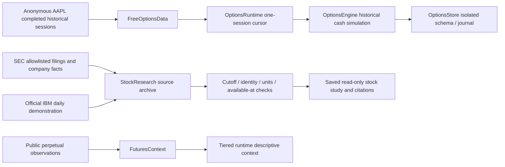
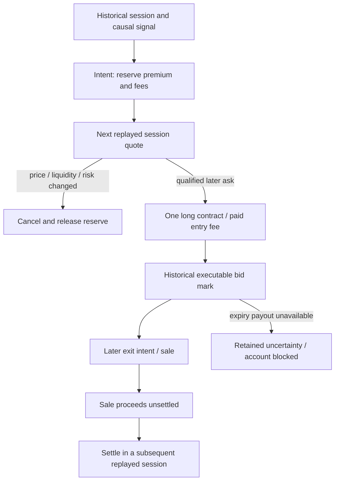
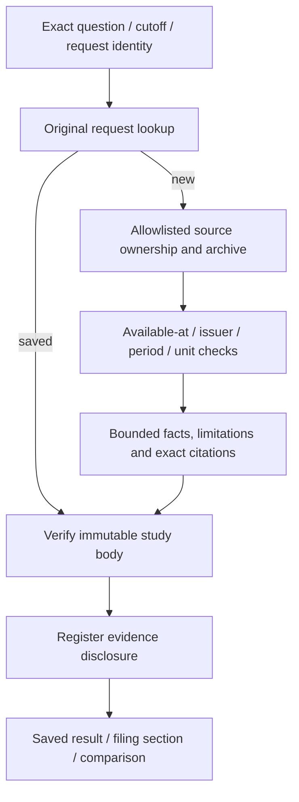

# Options replay, stock evidence and futures context

These owners are adjacent research paths. They do not expand cash-spot rule authority or establish live derivatives/equity execution. This guide maps source and test declarations; it does not report fresh provider requests, entitlement, runtime activation or financial acceptance.

## Boundary map

Options replay has a financial simulation/journal in a separate schema. Stock research has immutable evidence/studies and disclosure accounting but no equity order/funding owner. Futures observations are descriptive context only. The main public-futures adapter and dashboard route are mapped by the market-data guide; this page documents their domain boundary.

## Options replay

[OptionsRuntime](source-index.md#options-runtime) uses [FreeOptionsData](source-index.md#options-data) and [OptionsEngine](source-index.md#options-engine). Source mode is anonymous completed historical AAPL EOD data, not live NBBO or an authenticated broker feed. The engine has its own primary/variant accounts, $100 fake seeds and market-session cursor.

### Source identity and acquisition

[FreeOptionsData.get](source-index.md#options-data-get) allows only explicit AAPL daily-candle, chain and standard-contract quote routes with a small fixed query-key set. Options dates must be historical; candle intervals are completed and bounded. No token/environment credential input, real-time route or arbitrary symbol is accepted.

Each request first consumes the [durable UTC-day request budget](source-index.md#options-request-budget). Collection uses its fixed spacing, 12-second transport/clock bound, no redirects, capped body and rate-limit backoff. Original wire, path/query, source ID, timestamps and SHA accompany the result. A failed request remains used; retry does not mean free replenished budget.

[Session/quote parsing](source-index.md#options-data) bounds session calendars, chain count and column sizes; verifies provider session date; accepts standard unadjusted AAPL roots with multiplier 100; retains missing historical Greeks/IV explicitly. Existing replay reads at most one next remaining session per worker step. Calendar refresh cannot silently jump over an older retained cursor; an explicit gap review is required.

### Policy and simulated execution

[Options policy](source-index.md#options-policy) has two frozen momentum/selective variants, historical underlying direction checks and contract qualification by expiry, spread, displayed size, volume and open interest. Standard purchased calls/puts only are implemented. Fully covered short-option research is a policy allowance, not an implemented short-option fill path here; no naked option, margin or futures execution follows.

The multiplier and $0.50/contract/side fee are explicit simulation assumptions. A one-contract purchase reserves its full premium plus entry/exit fee within the 2.5% equity and settled-cash risk budget. [Entries](source-index.md#options-entries) allow one position/pending contract at a time and retain the actual rejection reason. Lack of an affordable contract is expected under a small cash/risk envelope; it is not permission to raise the budget.

[fill_pending](source-index.md#options-fill) gives a pending intent one chance at a subsequent replayed session. It cancels if the quote is unavailable, expired, worse than the limit, illiquid or outside the unchanged risk budget. No same-session fill is inferred. [close_position](source-index.md#options-close) retains paid fees and sale proceeds; [settle_cash](source-index.md#options-settle) releases proceeds only on a later session. Missing expiry/exercise information cannot invent a payout or trigger reviewed replenishment while the holding remains unresolved.

[process_session](source-index.md#options-session) rejects repeated/backward sessions and retains original source receipts. Gaps and missing held quotes remain journaled. Invariants enforce long, one-contract ownership, sufficient reservations and nonnegative settled/unsettled cash.

### Review, storage and cold recovery

[Options review](source-index.md#options-review) runs on its wall-clock schedule, even when a new historical source is unavailable. It can choose only frozen future option policy after its complete historical window gates; replay outcomes are not contemporaneous live market outcomes. [Attempts](source-index.md#options-attempts) retain the historical reviewed strictly-below-$5 fake funding path only when fresh/flat/resolved, including fees/loss history and replay cooldown.

[OptionsStore](source-index.md#options-store) wraps the journal owner with an isolated `options_paper` or `test_options_<id>` schema and `cash_options_research` projection. Its initialization validates kind; spot projection cannot be shared. [Options reconciliation](source-index.md#options-reconcile) checks event asset balance and projected cash, reservations, inventory, fees, unsettled proceeds and fake funding separately. Restart resumes the persistent forward-only historical cursor and original budget/history; no synthetic replacement quote is supplied.

[App lifespan wiring](source-index.md#secondary-api-wiring) does not auto-create options for a fresh CP1 spot-only installation. Existing legacy options state can be reopened independently; source failure is retained without becoming a dependency of the spot financial loop. Local options entry controls affect this owner, not spot balances or public collector settings. See the dashboard/API map for route authorization and normal views.

### Options troubleshooting

| Symptom | Inspect | Source explanation |
| --- | --- | --- |
| No historical options account on a fresh spot install | [lifespan](source-index.md#secondary-api-wiring) | Fresh CP1 intentionally does not auto-create the legacy options owner. |
| No affordable contract | [entries](source-index.md#options-entries), [policy](source-index.md#options-policy) | Full premium, both fees, settled cash and 2.5% ceiling can reject every contract. |
| Request limit or source rate failure | [reserve_request](source-index.md#options-request-budget), [get](source-index.md#options-data-get) | Used requests persist; next UTC day/backoff is explicit, not a quote fallback. |
| Intent never filled / canceled | [fill_pending](source-index.md#options-fill) | Needs a later qualified session with acceptable ask/risk; an old snapshot is not execution. |
| Equity cannot be resolved at expiry | [mark/session](source-index.md#options-session), [attempts](source-index.md#options-attempts) | Retain uncertainty; do not invent payout, top up or replay the day. |

## Stock evidence studies

[StockResearch](source-index.md#stock-research) is a saved evidence study owner in the existing experiment registry and research archive. [StockQuestion](source-index.md#stock-question) binds security, explicit as-of cutoff, hypothesis, optional market mode and request identity. There is no stock paper account, order fill or broker authority in this module.

### Sources and cutoff meaning

[public_url](source-index.md#stock-public-url) allows exact official SEC ticker/submissions/companyfacts/filing paths and the fixed official Alpha Vantage IBM demo. [fetch_public](source-index.md#stock-fetch) rejects arbitrary URLs, credentials, redirect/private-address exposure and unsupported sources. Collection is bounded and rate-controlled. Current issuer mapping is not a reconstructed point-in-time security universe or share-class history.

[source/_source](source-index.md#stock-source) retains versioned original bytes/hash, retrieval/validation times and shared-storage reference. Request/source ownership and persistent refresh state prevent overlapping connections from inventing separate originals. Unchanged refreshed bytes keep their first-known identity; missing/altered retained archives refuse before a fresh fetch can masquerade as recovery. An archive read can fail even when source metadata still exists.

[known_at and reported_facts](source-index.md#stock-reported-facts) bind source accession, accepted time or conservatively available date, reporting period and exact unit. Only facts available at the question cutoff are selected. [ratios](source-index.md#stock-ratios) require compatible period/unit inputs; mismatches yield unknown with reason, not a normalized guess. The filing timeline uses actually available source filings and keeps revisions distinct.

[investigate](source-index.md#stock-investigate) resolves the source identity and builds bounded facts/timeline/ratios with original citations. Current downloaded revisions are not proof of historical as-seen vintage. It does not invent macro vintages, analyst consensus, historical security membership, filing causation or adjusted total-return evidence.

### IBM demonstration and saved recovery

[market_summary](source-index.md#stock-market-summary) accepts only IBM daily demo metadata/timezone and bounded OHLCV. Sessions are conservatively available two days after their date. It reports raw price change and optional SMA20; unavailable corporate actions mean no adjusted-price or total-return claim. No personal real-time feed entitlement is verified.

[market_study](source-index.md#stock-market-study) explicitly distinguishes this price-only demonstration from verified SEC issuer identity. A stock filing study with an unsupported market security retains unavailable market data rather than silently substituting IBM. [Original request recovery](source-index.md#stock-request-recovery) validates exact mode/security/cutoff/hypothesis intent and returns the saved study before new mutable sources. UUID reuse with changed intent refuses.

[get](source-index.md#stock-get) verifies the saved body SHA and registers its disclosure in `evidence_windows`. Therefore a financially read-only saved-study GET is not literally registry-write-free. [section/compare_filings](source-index.md#stock-sections) reopen exact saved sources and bounded phrase matches, not arbitrary file paths or URLs. Source acquisition and disclosure are research state changes, not equity financial changes. Protected/exposure accounting must be considered before using a supposedly unseen study for evaluation.

## Futures descriptive context

[FuturesContext](source-index.md#secondary-futures-context) carries public perpetual funding/open interest/basis observations to the Tiered runtime and reviews. It is not a futures execution/risk/funding account. Source timestamps, missing fields and adapter limitations remain descriptive; they do not alter spot rule/risk permission. A proposed predictive relationship would need its own forward comparison. Main acquisition/caching/dashboard owners belong to the market-data guide.

## Covering tests and unknown boundaries

| Area | Source tests / important boundary |
| --- | --- |
| Full premium, later-only fills, settlement, expiry uncertainty, reviewed attempts | [Options tests](source-index.md#options-tests) |
| Historical cursor restart, separate PostgreSQL journal and spot isolation | [Options store/runtime test](source-index.md#options-store-test) |
| Due review despite unavailable source and local controls | [Options runtime failure test](source-index.md#options-runtime-failure-test) |
| Cutoff/revision/units, untrusted URLs and private-address rejection | [Stock tests](source-index.md#stock-tests) |
| Exact source reopening, expired refresh ownership and missing archive refusal | [Stock archive tests](source-index.md#stock-archive-tests) |
| Raw demo actions/entitlement and complete saved study disclosure | [Stock market test](source-index.md#stock-market-test), [stock pipeline test](source-index.md#stock-pipeline-test) |

The tests can use constructed provider payloads, mocked transport and disposable stores. They do not establish current availability, free-provider terms, live quote completeness, corporate-action coverage, provider entitlement, real calendar duration, economic qualification or installation. No code here supplies futures execution, a generalized U.S. equity trading engine, real-time options entitlement, historical Greeks/IV, an expiry exercise/settlement payout source or an unbiased point-in-time equity universe.
