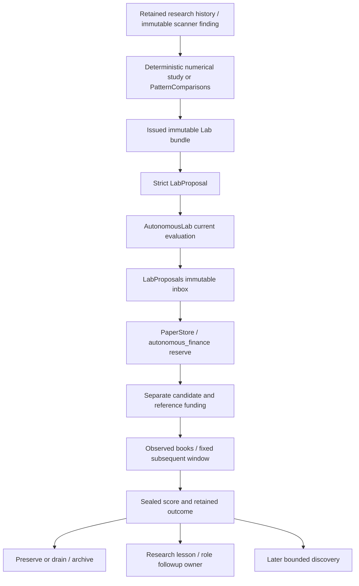

# Strategies, experiments and economic decisions

This is a source map, not a strategy recommendation or a report that these tests ran. Fixed numerical methods, model suggestions, prepared scanner findings, inbox submission, funded paper comparisons and forward designation have separate owners and evidence requirements. Account execution and financial storage are mapped in [paper accounting](paper-accounting.md).

## Experiment owners and boundaries

[AutonomousLab](source-index.md#autonomous-lab) orchestrates existing registry proposals and the financial writer. [LabProposals](source-index.md#lab-proposals) owns issued bundle/proposal identity and inbox state. [Autonomous finance](source-index.md#lab-finance-reserve) owns reservations, account creation, funding, observation, scoring and retirement inside PaperEngine transactions. Model roles are advisory consumers/producers under the separately versioned role contract and grant; this guide does not equate a model answer with an admitted trial.

| Path | What it produces | What it does not establish |
| --- | --- | --- |
| [Numerical candidate evaluation](source-index.md#numerical-candidates) | Frozen preprocessing/model artifact, common-window comparisons and retained search outcomes | Fresh prospective success or permission to raise risk |
| [Pattern comparison preparation](source-index.md#pattern-prepare) | Verified original finding, archive proof, matched current numerical inputs, immutable issued bundle | Inbox insertion, model dispatch, funding or detector trading edge |
| [Lab evaluate/submit](source-index.md#lab-evaluate) | Current deterministic assessment, then separately checked inbox publication | Funding in the submit call |
| [Autonomous step](source-index.md#lab-step) | Guarded reserve/fund/observe/review continuation through existing owners | Unlimited proposals, ignored pauses or arbitrary strategy code |
| [Forward qualification](source-index.md#paper-forward-comparison) | Complete subsequent whole-account policy report | Automatic live promotion or independent statistical significance |

## Versioned strategy schemas

[RuleSpec](source-index.md#lab-rule-spec) is frozen, extra-forbidden and limited to reviewed BTCUSD closed-minute inputs and the existing cash-only hard-stop envelope. Its timing presets bind feature interval, warmup, maximum hold, progress and review; they are not independently tunable knobs.

| Schema | Supported difference |
| --- | --- |
| `reviewed-lab-rules-v2` | Legacy breakout/range-reversion mechanism and bounded lookback under a complete short/medium/long preset. |
| `reviewed-lab-rules-v3` | Additive frozen historical-memory entry filter, genuine short horizon and declared component daily cost; underlying entry/exit/risk controls remain versioned. |
| `reviewed-lab-rules-v4` | One fixed bank mechanism from [redesign strategy](source-index.md#redesign-strategy), medium horizon, lookback 10 and no memory entry filter. Warmup is 305 minutes; complete native five-minute groups are derived from retained minute input. |

[RuleSpec coherence](source-index.md#lab-rule-spec) rejects a v4 lookback child and rejects a fixed bank family without v4. [LabProposal semantics](source-index.md#lab-proposal-spec) distinguishes:

- Variation: exact parent/reference hash and one allowed lookback or additive memory-component change.
- Independent: genuinely different candidate/reference mechanism, with no implied financial parent.
- Replication: explicitly named replication and identical candidate/reference configuration.

[Contract disclosure](source-index.md#lab-rule-contract) includes actual active and inapplicable controls, timing, cost and risk assumptions. [reviewed_feature](source-index.md#reviewed-feature) reproduces the correct versioned bank or component input route; it does not silently adopt a different horizon from a family name.

## Fixed scanner-motivated methods

[PatternComparisons](source-index.md#pattern-comparisons) supports exact saved BTCUSD/native-5m, volume-confirmed resistance breakout/retest motivation. It verifies the original daily/event/level bodies, native times, hashes and retained chunks, using bounded archive reads. A native pivot-zone detector finding motivates an experiment; it is not substituted for the bank's current entry predicate.

The [fixed role method catalogue](source-index.md#pattern-methods) is explicit: p0 is breakout-retest versus cost-breakout; p1 is trend-pullback versus the same cost-breakout reference. Both use v4 medium controls. Method ID/policy SHA, previous method and next method are distinct identities. P1 is independent (`parent_trial=None`), so its funding does not mark p0 as a financial variation parent. Catalogue implementation does not mean the active grant offers every method.

[Describe](source-index.md#pattern-describe) verifies original identity. [Prepare](source-index.md#pattern-prepare) and [current observation](source-index.md#pattern-current-observation) capture separately retained bounded public-minute inputs and exact candidate/reference evaluations. The original request is recovered before consulting mutable readiness. Waiting preparations remain immutable; a new observation requires a new explicit identity. Changed intent cannot reuse the old UUID.

Used methods have a separate research-only route: immutable receipt and current evidence can remain available with `dispatch_available=false`, no ordinary submit-ready proposal and a clearly read-only comparison template. It preserves the used-rule, capacity, policy, causal-input and protected-window guards. The ordinary API preparation route does not become authority to waive them. Role policy/grant selection and attempted model requests belong to the role maps.

## Inbox, capacity and restart recovery

[LabProposals.bundle](source-index.md#lab-issued-bundle) publishes bounded content-addressed evidence in `lab_bundles`; evidence disclosure checks exclude protected holdout/prospective intervals and register training exposure. Issued bundles are capped at 64 KiB. A digest alone is not enough when its retained artifact is missing.

[Submit](source-index.md#lab-inbox-submit) validates the exact original proposal body/request and issued bundle. Used candidate-rule identity cannot be disguised as a new independent trial; ordinary active inbox capacity is four jobs. [Original get](source-index.md#lab-inbox-get) and fixed financial reservation/funding receipts allow acknowledgment recovery without another proposal or duplicate funding. A missing artifact, drifted body, unscoped existing row or uncertain financial acknowledgment must not be reclassified as successful new work.

[LabPolicy](source-index.md#lab-policy) freezes slots, family/independent reserve, starting cash, declared operating costs, coverage fraction, horizons and work/period limits. [Slots](source-index.md#lab-slots) includes active/reserved/retiring commitments; holdings, pending orders, dust, faults and uncertain execution prevent falsely freeing a slot. Diagnostic-purpose accounts are never eligible research peers.

[AutonomousLab._step](source-index.md#lab-step) first checks its schedule, paper health, resource/storage availability and work budget. It then recovers committed outcome acknowledgments and scores mature sealed windows before the proposal-pause gate. New reserve/fund/discovery also require capture availability, capacity and current input evaluation. Reserve and fund happen through the existing financial transaction; registry transactions are not held across PostgreSQL writer work. Optional finite grants add exact saved proposal fences and expiry/one-chain/attempt constraints through [finite dispatch](source-index.md#lab-finite-dispatch) and the existing finite owner, not a second financial engine. Already committed outcome/account management has different continuation semantics from a new effect.

## Observed outcome and account retirement

[Reserve](source-index.md#lab-finance-reserve) freezes the exact matched contract; [fund](source-index.md#lab-finance-fund) creates separately funded candidate/reference accounts. Only a valid variation marks its preserved parent as branched. Review is due from actual funding plus the larger of the policy horizon and fixed rule review interval. V4's six-hour maximum holding duration is not its 24-hour minimum review window.

[Observe](source-index.md#lab-finance-observe) retains actual account marks, exposure, passive benchmark execution, coverage and input validity. [Review](source-index.md#lab-finance-review) requires the fixed sealed window; it retains full candidate/reference samples and dependence qualification. Fees and execution/liquidation costs are embedded once in equity. Declared per-account operating costs and component costs are then subtracted for the elapsed window.

| Outcome | Source meaning |
| --- | --- |
| `risk_stopped` | Original hard stop retained; no replenishment or risk escalation. |
| `data_blocked` | Incomplete executable marks/coverage or inputs; does not claim strategy failure. After-cost comparison values can be null. |
| `low_information` | Complete window with flat, untraded candidate and reference; idle operating costs remain. |
| `promising` | Positive candidate after costs, at least reference and full-period passive; exploration only, not CP7/live promotion. |
| `economically_unsuccessful` | Negative after-cost candidate or below matched reference under valid coverage. |
| `inconclusive` | Supported window without a positive economic distinction. |

Promising trials preserve the unchanged candidate and retire the matched reference. Other unprotected trials enter [retirement](source-index.md#lab-finance-retirement); archives are written only after flat/no-pending and resolved fault/uncertainty. Operator protection can retain a scored trial. [PaperStore Lab history](source-index.md#paper-lab-history) and archived account events preserve removed active rows. Eight active accounts and eighteen archived identities would be different facts, not twenty-six running accounts.

## Subsequent discovery and preserved parents

[AutonomousLab.propose](source-index.md#lab-propose) first considers eligible preserved/unbranched legacy parents and allowed single-control lookback children. It skips fixed v4 only in that generic variation loop: unsupported nested v4 lookback mutation must not prevent later baseline/independent/replication discovery. Parent strategy, protection, cash, funding, risk and financial history are not rewritten by this skip.

The later paths retain used-rule, family/reserve and timing gates. Exact replications are explicitly labeled and need a subsequent recorded window; inspected earlier results select a question, not its answer. [Preserved-v4 tests](source-index.md#preserved-v4-discovery-tests) cover this boundary and ordinary engine/bar availability. Existing non-v4 variation is still a separate supported path.

## Original input and cost diagnosis

[scoped_tools.run](source-index.md#strategy-diagnosis-dispatch) assigns `input_diagnosis` and `cost_diagnosis` to an exact account, symbol and bounded interval. It uses a separate authenticated repeatable-read financial snapshot, accepts retained account identities, and refuses unavailable accounts or diagnostic-purpose peers without falling back to primary. The existing tool journal retains the original result/envelope; [disclosure](source-index.md#strategy-diagnosis-disclosure) records consumed information in the research registry. This path explains evidence and accounting; it does not change strategies, place orders or infer a model answer.

[input_coverage](source-index.md#strategy-input-diagnosis) reads the existing research index in read-only mode and reopens exact archived decision references. It inspects at most six retained records within one hour, with eight MiB of logical payload and a two-second query budget. Missing archive, identity conflict or exhausted budget refuses rather than substituting current data or returning a partial success. Original account/market eligibility, book and candle availability, feature provenance and the decision at that tick remain distinct. An earlier saved decision is not a new no-signal verdict; sparse retained samples do not establish all-tick coverage, missed opportunities or continuous executable input.

[cost_diagnosis](source-index.md#strategy-cost-diagnosis) reuses permanent closed-event accounting for the same account/market/time cohort, including negative and no-trade outcomes. It adds recorded fees back once to show gross before those fees, keeps net and open holdings separate, and retains whole-account equity, funding, valuation time and original cost groups. Unknown or invalid totals refuse; unknown historical costs remain unknown. Mixed versions/correlated trades and current request counters do not establish a matched experiment, historical transport totals or a causal sizing/exit/liquidity defect.

[Diagnosis tests](source-index.md#strategy-diagnosis-tests) cover original input versus absent/late evidence, bounded cold reads, missing archives, fee accounting, invalid/no-trade results and exact saved API reopening despite current catalog/worker faults. For a no-change or data-blocked research answer, inspect this original evidence and its unresolved causes before selecting a genuinely new question or requesting a missing tool; a diagnosis does not make an unoffered rule available.

## Components and account campaigns

[MemoryFilter](source-index.md#lab-memory-filter) requires a validated frozen artifact, causal input and an explicit finite component daily cost. [Rule components](source-index.md#reviewed-feature) apply it to entry only; unsupported rejection does not touch exits or weaken base risk. [Memory account studies](source-index.md#memory-accounts) compare matched inputs/costs with retained consumed-history boundaries.

[Portfolio component evaluation](source-index.md#portfolio-components) studies size, exit or observation priority as separate ablations. Its source returns inconclusive/reject and unknown whole-account effects when prospective qualification is unavailable; no pooled fictitious capital or qualified forwarding is inferred from replay output. [Numerical candidates](source-index.md#numerical-candidates) freeze fit/preprocessing once and preserve failed searches and gaps.

[CampaignSpec](source-index.md#paper-campaigns) creates one retained ten/fourteen-account campaign with distinct labels and own $50/$100 capital, execution/cost assumptions and account controls. It does not change Lab rule semantics or merge account balances. [Forward challenger admission](source-index.md#paper-challenger-admit) separately freezes numerical artifacts/costs, limits admissions and requires explicit funding through PaperEngine.

[Campaign tests](source-index.md#paper-campaign-tests) cover cash isolation, individual/global entry pauses and sibling rollback; [numerical candidate tests](source-index.md#numerical-candidate-tests) cover frozen preprocessing, missing history, later signals and atomic admission without duplicate funding.

## Forward qualification and designation

[Whole-account economics](source-index.md#paper-economics) use funding-adjusted executable equity, cash and full-period passive exposure controls. Unknown operating costs remain unknown. Paid fees and spread/slippage already represented in fills/marks are not deducted twice. Window eligibility depends on matching configuration, capital/funding, risk, instrument universe and fresh coverage.

The legacy engine's two-window flat change is separate from [paper_learning.comparison](source-index.md#paper-forward-comparison). The latter accepts only frozen forward numerical candidates with a matched incumbent control and observed-public-feed label. It discards earlier/inspected/incomplete/mismatched windows, requires 28 subsequent contiguous complete daily blocks and declared dependence/selection, stability, drawdown and stress margins. Its HAC error is descriptive; policy thresholds are not p-values. More than the bounded 512 windows cannot certify full history.

[Report retention](source-index.md#paper-learning-report) journals the full immutable receipt and keeps a compact projection. [Designation](source-index.md#paper-designate) needs exact report SHA, current expected role/configuration, freshness and explicit approval; it changes the incumbent role pointer without transferring capital. [Rollback](source-index.md#paper-designation-rollback) preserves attempts, fees, losses, holdings and funding. A qualifying paper report still does not authorize live orders.

## Troubleshooting and covering tests

| Symptom | Source owner and covering tests |
| --- | --- |
| Preparation is waiting / original cannot reopen | [prepare/get](source-index.md#pattern-prepare), [comparison tests](source-index.md#pattern-comparison-tests): original identity, archive proof, retained current-input references and missing-artifact refusal. |
| Proposal queued but no accounts funded | [step](source-index.md#lab-step), [inbox](source-index.md#lab-proposals): current capture, work/capacity/paused/finite fence and exact reservation acknowledgment. [Autonomous tests](source-index.md#autonomous-lab-tests) cover lost ack/contention. |
| Fixed preserved parent blocks discovery | [propose](source-index.md#lab-propose), [fixed-parent tests](source-index.md#preserved-v4-discovery-tests): skip only unsupported v4 lookback mutation. |
| Completed trial has no profit result | [review](source-index.md#lab-finance-review): distinguish data-blocked nulls, complete idle low-information and actual after-cost negative outcome. |
| No trades or fees dominate a result | [input diagnosis](source-index.md#strategy-input-diagnosis), [cost diagnosis](source-index.md#strategy-cost-diagnosis), [diagnosis tests](source-index.md#strategy-diagnosis-tests): inspect exact selected cohort, causal inputs and recorded costs; unknown opportunity is not measured missed profit. |
| Active count drops or slot remains occupied | [retirement](source-index.md#lab-finance-retirement), [history](source-index.md#paper-lab-history): retain score/archives; holdings/dust/uncertainty cannot free capacity prematurely. |
| Filter/size replay looks promising but not offered | [components](source-index.md#portfolio-components), [component tests](source-index.md#portfolio-component-tests), [rule tests](source-index.md#rule-component-tests): implemented experiment is not qualified dispatch authority. |
| Forward candidate cannot replace primary | [comparison/designation](source-index.md#paper-forward-comparison), [learning tests](source-index.md#paper-learning-tests): all complete future blocks, matched controls and exact approval are required. |

Tests using accelerated clocks, constructed bars or a stub model establish software transitions only. Genuine disposable engine orders/fills, balance checks and adverse outcomes are useful accounting proof, but are not real elapsed horizon, prospective coverage, model usefulness, economic edge or installed activation evidence.
