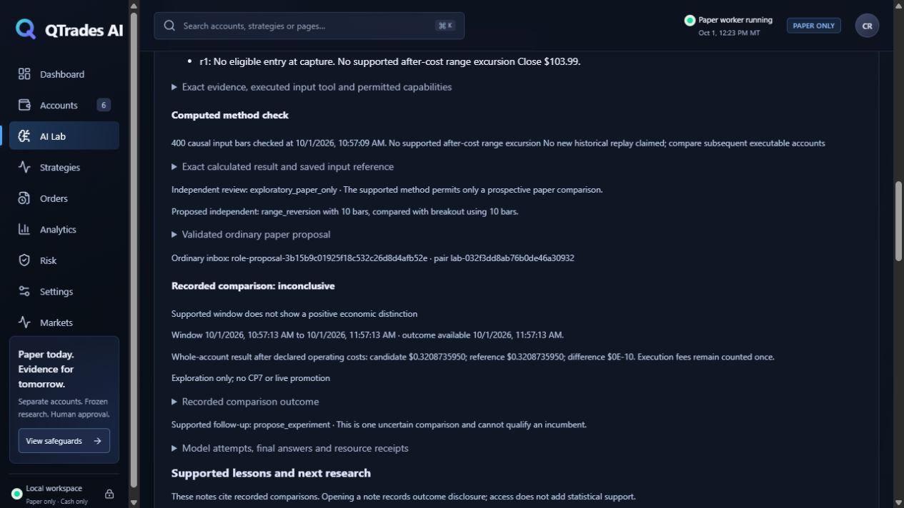

# CP23 integrated software acceptance and precise remaining proof

The operator can reopen a recorded ordinary paper comparison, read its calculated
inputs/review/whole-account result, retrieve a cited lesson, and open the justified
different next question. Stock requests preserve their exact identity/cutoff across
unknown acknowledgment and restart. Late native answers are retained and reconciled
without silently requesting another verdict. Equal-time history pages conserve IDs.
Normal UI reports disabled/unqualified roles, unknown costs/value and disconnected
retained state explicitly. These are source/QA results; actual qualified-model
acceptance remains blocked.

Base CP22: `dd55b89b2c772e4d24fb7d06966b7f4d74374f04`.
Final full-tested product source: `197e5a1894b16b01af71604664048dc23a03bd34`.
Measurement #2 source was b76fd61; after the final database-recovery correction,
the same final workload is rerun and its exact source hashes retained separately.
Subsequent delivery changes are documentation/public receipts only. The draft/issue
records the final delivery head and exact-head hosted check.
Read the [predeclared plan](../../CP23_ACCEPTANCE_PLAN.md) and
[ready-to-authorize handoff](../../CP23_ROLLOUT_HANDOFF.md).

## Observed gates

Full native Windows/Python 3.12/disposable PostgreSQL: **629 passed, zero skips**,
201.19 seconds, one existing Starlette/httpx deprecation warning. The affected
role/actor/lesson/stock/integrated selection passes **37 tests**, zero skips in
13.34 seconds. Whole-repository Ruff passes; strict mypy passes **82 source
modules**. TypeScript/production build passes, **1925 transformed modules** in
992 ms. All seven new integrated regressions are included in hosted native selection.
The final database-outage correction additionally passes 17 affected tests in
8.88 seconds, then the complete 629-test rerun. The preceding complete 628-pass
run in 213.68 seconds stays retained. Exact final delivery head/hosted results
remain separate from these source receipts.

The native reader driver uses actual SCRAM-SHA-256 password authentication against
the separately owned disposable PostgreSQL cluster. Bad credentials are rejected,
the transaction is REPEATABLE READ/read-only, permanent outcome queries preserve
financial state/events, credentials are absent from responses, the exact HBA hash
is restored, and generated reader role/schema are removed. API tests separately
cover operator requirement/origin and bearer least privilege.

Original CP23 focused failure: 26 passed/one failed in 11.18 seconds. The market
fixture supplied one row while its unchanged declared minimum is two; the fixture
now supplies two. No validator was weakened. Original measurement #1 passed all
declared limits but the older summary helper omitted p50. It remains retained;
measurement #2 adds the actual median and repeats the same workload/limits. Neither
receipt is renamed or substituted for a failed SLO case. Earlier CP17–CP22 failed
logs/runtime attempts remain with their checkpoint receipts.

## Finite native measurements

Actual Windows/disposable PostgreSQL, six 30-second one/ten/twenty cases, 120 ticks
each, with 1103 retained synthetic outcome events and an archived account. Busy
means an actual constrained CPU numerical-fit process, not an LLM request. Its
Windows IDLE/two-processor placement is measured. All six cases passed unchanged
limits and exact balanced-journal/projection reconciliation.

| Accounts / work | Financial p50 ms | p95 ms | p99 ms | Max ms | Peak parent MiB |
|---|---:|---:|---:|---:|---:|
| 1 idle | 3.566 | 5.805 | 7.000 | 7.465 | 71.496 |
| 1 numerical | 3.716 | 8.017 | 19.865 | 20.900 | 71.945 |
| 10 idle | 9.078 | 29.702 | 33.023 | 58.889 | 72.410 |
| 10 numerical | 11.004 | 32.325 | 34.107 | 65.873 | 72.609 |
| 20 idle | 14.632 | 32.756 | 38.134 | 73.828 | 73.379 |
| 20 numerical | 11.216 | 37.504 | 58.032 | 84.518 | 73.480 |

Queue peak is one; maximum queue-lag p99 is 0.539 ms. Maximum parent RSS growth
is 0.703 MiB and measured one-core parent CPU is 6.923%. Tiny one-account process
CPU samples round to zero on Windows; this does not mean zero hardware cost.
The fit children perform 363–366 fits, use 28.859–29.125 CPU seconds and peak at
60.668–61.113 MiB. Host CPU includes unrelated activity (30.720–40.818%).
Database growth is 393216–1441792 bytes per case, with 16/160/320 journal lines.
Parent I/O counters are recorded; PostgreSQL-server I/O is not attributed. Synthetic
last-tick freshness is 0.295–1.983 seconds including child teardown, not actual
market freshness. UI-state timing is server read/serialization, not browser paint.

Two additional twenty-account 30-second scoped-tool cases have 120 writes each.
Idle financial p50/p95/p99: **15.391/46.760/60.914 ms**; scoped reads:
**13.268/33.496/110.764 ms**. Forty-one reads have query p50/p95/p99
**77.104/172.751/202.281 ms**, serialization p95 0.843 ms, compact overview max
**4824 UTF-8 bytes** and full receipt max **44460 bytes**. Query p95 is reported
as measured; the declared 100-ms limit applies to financial p95. Scoped peak RSS
is **75.844 MiB**, growth **1.504 MiB**, balanced with no errors. Both cases pass.

G: quotas are the existing **100 decimal GB per tier**, on a verified owned volume
and separately owned subtree. Actual written bytes are small. Proportional storage
fault fixtures and these finite cases do not establish full 100-GB throughput,
24/7 operation or simultaneous actual-model load. Exact source hashes, thresholds,
all numerical cases and the sanitized native admission blocker are in
[finite-native.json](finite-native.json).

## Requirement → representative regression → ordinary surface → stage

| Requirement | Named native proof | Surface / stage and limitation |
|---|---|---|
| Full proposal/result/next question | `test_worker_ordinary_inbox_outcome_and_supported_followup`; `test_two_generations_referenced_different_test_and_restart_dedupe` | Saved task/lesson UI, two real disposable funded/scored comparisons; model stub/accelerated maturity |
| No financial inference lock | `test_slow_model_releases_financial_and_registry_locks` | Independent engine writes while explicit transport fixture waits |
| Stopped/changed/unapproved/unavailable model | `test_resource_guard_blocks_before_any_model_request_and_does_not_unload`; `test_unapproved_placement_models_or_allowances_rejected`; `test_unavailable_reviewer_and_allowance_waits_do_not_dispatch_or_starve` | Required admission/identity/reviewer wait; actual model qualification blocked |
| Hung/unknown/retry/verdict and durable answer boundary | `test_operational_retry_retains_failed_allowance_and_cannot_retry_a_verdict`; `test_completed_answer_survives_crash_before_dispatch`; `test_late_native_completion_recovers_unknown_without_fresh_verdict` | Completed answer saved before dispatch; late result reconciled once; explicit stubs, no fresh preferred verdict |
| Every orchestrator dispatch/admission/score boundary | Prior two answer tests; `test_lost_submission_ack_reconciles_stable_proposal_without_second_effect`; `test_before_after_admission_and_score_ack_crashes_recover_once` | Stable ordinary proposal and one immutable funding effect, not a new financial writer |
| Invalid/injected/authority mismatch | `test_strict_capability_membership_and_contradictory_approval`; `test_invalid_external_output_retained_without_verdict_retry`; stock injected-excerpt test | Strict semantic contract, retained rejection, source text treated as evidence |
| Current contract without rewriting mature history | `test_stale_contract_followup_keeps_mature_history_without_new_inference`; `test_legacy_exact_serialization_and_single_supported_delta` | Additive v3 preserves v2; old outcome readable but new inference requires current contract |
| Duplicate/out-of-order/late labels | `test_crash_restart_duplicates_reordering_do_not_double_train`; `test_delayed_label_scores_original_late_result_without_relabeling_recognition` | Frozen original forecast and mature-target learning; no timing relabel |
| Pending long horizons | `test_long_trial_matures_only_after_its_declared_week`; `test_blocked_acquisition_matures_due_full_and_compact_without_editing_sources` | Due checks continue without pretending new acquisition or premature maturity |
| Full/deferred queue, independent work and pause | `test_full_deferred_queue_waits_without_generating_or_issuing_bundle`; `test_transient_family_wait_allows_independent_work_and_retry`; `test_deferred_discovery_respects_resource_budget_and_pause_guards` | Specific wait dependencies, independent eligible work and operator pause |
| DB outage and unknown acknowledgment | `test_database_outage_retains_mature_outcome_and_recovers_once`; `test_lost_submission_ack_reconciles_stable_proposal_without_second_effect`; `test_saved_stock_request_reconciles_after_restart_without_source_fetch` | Real QA DB plus explicit outage fixtures; saved exact intent, no duplicate financial effect |
| Twenty capacity/originals/parents/costs | `test_twenty_concurrent_slots_include_reservations_and_ordinary_accounts`; `test_hard_stop_and_operating_costs_are_preserved_without_double_charging`; `test_real_runtime_consumes_component_and_preserves_frozen_parent` | Original protected accounts, preserved parent hashes, sole writer and costs once |
| G: missing/full/wrong identity and no spill | `test_absence_mapping_access_and_quota_no_spill`; `test_due_continuation_is_bounded_and_resource_pending_survives_restart` | Proportional/owned fixtures only; operating G: untouched |
| Archive rollover/reclamation/interrupted acknowledgment | `test_rollovers_reopen_pending_and_two_hour_continuation`; `test_failed_transfer_last_source_checksum_and_recovery`; `test_all_eligible_segments_reclaim_with_protection_and_restart` | Exact references/protection/restart, no destructive operating cleanup |
| Large history with bounded queries | `test_more_than_5000_receipts_reopen_failures_and_stable_request_ids`; `test_physical_journal_pressure_archives_before_64_mib`; `test_role_history_equal_timestamp_cursor_conserves_all_ids` | More than old logical caps; composite cursor conserves tied timestamps |
| Disclosure before cached/page/lesson/external delivery | `test_saved_and_cached_disclosure_consumes_once_and_metadata_exposes_no_results`; `test_captured_analogue_consumes_outcomes_before_cached_delivery`; `test_retrieval_disclosure_access_not_weight_and_append_notes` | Retrieval/access does not become statistical weight |
| External least privilege/revoke/ownership | `test_scope_actor_spoofing_urls_operator_and_revoked_access_fail`; `test_stale_local_worker_cannot_overwrite_external_answer`; `test_revocation_keeps_financial_positions_history_and_answer` | Real local HTTP adapter; no installed Crik/authorized bridge |
| Optional disable/rollback without reset | `test_disabled_worker_persists_specific_wait_without_attempts`; actor revocation test above | Off/grant revoke preserves positions/history/answers; installed rollback not executed |
| Source-fetch operator gate and truthful quality | `test_source_fetch_requires_operator_and_bad_cursor_is_rejected`; `test_quality_report_keeps_unknown_tokens_and_no_matched_value` | Normal API/UI reports measured endpoint counts separately from conservative reservations/unknown value |

All named tests are in the complete native run; retained pre-existing regressions
are identified as such, not represented as newly authored fault campaigns. The
matrix does not claim exhaustive real operating crash/timeout/restart acceptance.

## Normal browser proof and remaining observations

[Browser checks](browser-checks.json) cover both ordinary comparisons, exact
evidence/method/review/receipt links, mature outcome and follow-up, cited source/cost/
unknowns, a different second question and meaningful wait, actual native public IBM
save/reopen, stock denial with exact pending request, selected-task refresh, grant
creation/revocation, role off/unqualified state, unknown quality and disconnected
retry. Narrow viewport is 390×844 with body/main 375 pixels; tables/JSON scroll
inside their containers. The owned preview was stopped by verified executable/PID/
creation identity to observe actual disconnection, then explicit retry retained the
recorded task and saved stock request. It did not touch the installed application.

[Mobile result](mobile-result.png) and [disconnected retry](disconnected-retry.png)
are retained. Synthetic captions remain visible; ordinary funded/scored paper
control flow is real disposable engine/database work, not qualified model evidence.

The real operating guard remains constrained (final sampled engine p95 156 ms,
commit p95 125 ms, cooldown 299.516 seconds). The corrected CP18 development
screen dispatched zero requests over 601.018 seconds; prior incomplete-screen
calls stay ineligible. No actual qualified-role workload or result-feedback trace
is established. Native SEC denial/cooldown and unavailable Crik transport remain
precise provider blockers.

The research-quality endpoint reports actual retained attempts, endpoint counts
where present, failed reservations and honest unknowns. **No matched qualified
A/B/C/D experiment has been conducted or demonstrated by this endpoint.** The
declared comparison and prospective whole-account economic observation remain
incomplete; unknown does not mean measured negative value. Retain deterministic
tools and required review, leave optional activation off, and complete these
observations only under their permitted runtime and operating conditions.

Source delivered, finite software verified, actual role qualified, actual endpoint
trace, installed verified, prospective evaluated and economic support are separate
stages. No merge, deployment, installed restart, operating activation/account/data
change, storage migration/cleanup, model download or paid service was performed.
